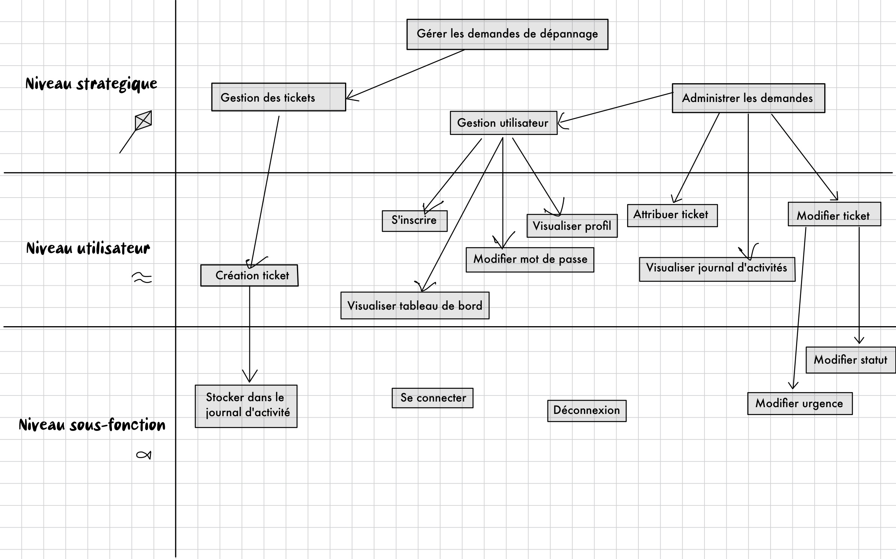

# 
<u>Recueil des besoins</u>

  

  <blockquote style="text-align: right;">
    Prénoms & Noms des étudiants : 
    Rayan BEN TANFOUS 
    Armand CLOUZEAU 
    Sarah BADER 
    Ismail AKBOULATOV 
    Aymeric PESENTI
  </blockquote>

## 
<u>Table des Matières</u>

### [<u>I. Chapitre 1 – Objectif et portée</u>](#chap1)

1. [Portée et Objectifs Généraux](#chap1.1)
2. [Les Intervenants](#chap1.2)
3. [Limites du Système](#chap1.3)
4. [Diagramme de niveaux des cas d'utilisation](#chap1.4)
### [<u>II. Chapitre 2 – Terminologie employée / Glossaire</u>](#chap2)

### [<u>III. Chapitre 3 – Les cas d’utilisation</u>](#chap3)

1. [Acteurs Principaux et Objectifs](#chap3.1)
2. [Cas d’utilisation Métier](#chap3.2)
3. [Cas d’utilisation Système](#chap3.3)

### [<u>IV. Chapitre 4 – La technologie employée</u>](#chap4)

1. [Exigences Technologiques](#chap4.1)
2. [Interfaces avec d'autres systèmes](#chap4.2)

### [<u>V. Chapitre 5 – Autres exigences</u>](#chap5)

1. [Processus de Développement](#chap5.1)
2. [Règles Métier](#chap5.2)
3. [Performances](#chap5.3)
4. [Opérations, Sécurité, Documentation](#chap5.4)
5. [Utilisation et Utilisabilité](#chap5.5)
6. [Questions non Résolues ou Reportées à Plus Tard](#chap5.6)
7. [Gestion des risques](#chap5.7)

### [<u>VI. Chapitre 6 – Recours Humain, Questions Juridiques, Politiques, Organisationnelles</u>](#chap6)

1. [Recours Humain](#chap6.1)
2. [Exigences Juridiques et Politiques](#chap6.2)
3. [Conséquences Humaines](#chap6.3)
4. [Besoins en Formation](#chap6.4)
5. [Hypothèses et Dépendances Humaines](#chap6.5)

  
### <u>I. Chapitre 1 – Objectif et portée</u> 

1. <u>Portée et Objectifs Généraux</u> 
    
    
   Le projet vise à développer une plateforme de ticketing
   interne en PHP & MySQL pour recueillir les demandes de
   dépannage des utilisateurs dans les salles machines.
   Les objectifs généraux sont :
    
    
    - Offrir un moyen efficace de soumettre des demandes de dépannage.
    - Faciliter la gestion des demandes pour les administrateurs.
    - Fournir aux utilisateurs un suivi de leurs demandes.
    - Permettre aux visiteurs de visualiser les dernières demandes.
    - Améliorer la communication entre les techniciens et les utilisateurs.
       
       
2. <u>Les Intervenants</u> 
    
    
   Les principaux intervenants comprennent :
    
    
    - Les étudiants et les professeurs utilisateurs de la plateforme.
    - L'administrateur système.
    - L'administrateur web.
    - Les techniciens de support.
    - Les visiteurs occasionnels.
     
     
3. <u>Limites du système</u>  
    
    
   La portée du système comprend la création et la gestion de
   tickets de dépannage, la gestion des utilisateurs et
   l'administration des libellés, des niveaux d'urgence et des
   tickets. Les limites du système excluent les fonctionnalités
   telles que la récupération de mot de passe par e-mail et
   d'autres fonctionnalités non spécifiées.
    
    
4. <U>Diagramme de niveaux des cas d'utilisation</u>   
   

### <u>II. Chapitre 2 – Terminologie employée / Glossaire</u> 

Le glossaire suivant définit les termes techniques et spécifiques au projet qui seront fréquemment utilisés tout au long
de ce document, afin de faciliter la compréhension et la communication autour du développement de la plateforme de 
ticketing interne en PHP & MySQL.

**Ticket** : Une demande de dépannage soumise par un utilisateur inscrit pour signaler un problème dans une salle 
machine ou une autre partie du système.

**Administrateur système** : L'individu responsable de la gestion et de la maintenance du serveur Raspberry Pi 4, du 
système d'exploitation, du serveur web Apache et du serveur SGBD MySQL.

**Technicien** : Un membre de l'équipe de support chargé de résoudre les incidents et de traiter les tickets de dépannage.

**Niveau d'urgence** : Une classification attribuée à chaque ticket de dépannage pour indiquer la gravité du problème, 
allant de faible à critique.

**Utilisateur inscrit** : Un individu enregistré sur la plateforme de ticketing interne, ayant la possibilité de créer 
des tickets, d'accéder au tableau de bord et de modifier son mot de passe.

**Visiteur** : Un utilisateur non enregistré qui peut seulement visualiser les 10 dernières demandes de dépannage sur 
la plateforme.

**Administrateur web** : L'administrateur de la plateforme qui est responsable de la gestion des libellés, de la 
définition des statuts du ticket, de la création de comptes techniciens et de l'affectation des tickets.

**Journal d'Activité** : Une fonctionnalité du système qui enregistre les détails de chaque validation de ticket, y 
compris la date, l'adresse IP, l'utilisateur qui a soumis le ticket et le niveau d'urgence.

**Formulaire d'inscription avec vérification CAPTCHA** : Un formulaire que les visiteurs doivent remplir pour s'inscrire
en tant qu'utilisateurs inscrits, comprenant une vérification CAPTCHA pour empêcher les inscriptions automatisées.

**Tableau de Bord** : L'interface où les utilisateurs inscrits peuvent voir la liste de leurs tickets de dépannage et 
leur état actuel.

**Connexion SSH** : Une méthode de connexion sécurisée au serveur Raspberry Pi 4 depuis les postes des salles machines 
via le réseau.

**Serveur Raspberry Pi 4** : Le matériel sur lequel le système est installé, utilisant un système d'exploitation, un 
serveur web Apache et un serveur SGBD MySQL.

**Capacité moyenne** : La capacité de la plateforme à accueillir jusqu'à une centaine d'étudiants simultanément.

### <u>III. Chapitre 3 – Les cas d’utilisation</u> 

1. <u>Acteurs Principaux et Objectifs</u>  
    
    
   **Utilisateur Inscrit** : Créer des demandes de dépannage, accéder au tableau de bord, modifier le mot de passe.
    
   **Visiteur** : Visualiser les 10 dernières demandes.
    
   **Administrateur web** : Gérer les libellés, définir les statuts du ticket, créer des comptes techniciens, affecter
   des tickets.
    
   **Techniciens** : S'attribuer des tickets, changer l'état du ticket.
    
   **Administrateur système** : Accéder au journal d'activité.
    
    
2. <u>Cas d’utilisation Métier</u> 
    
    
   **Cas d'utilisation impliqués dans les livrables** :
- [**Afficher la page web**](A4.Specification.md "lien vers le fichier des cas d'utilisation") : Ce cas d'utilisation concerne 
l'action d'accéder à la page web de la plateforme de ticketing interne.
- [**Gérer demande dépannage**](A4.Specification.md "lien vers le cas d'utilisation Gérer demande dépannage ") : Les
  utilisateurs inscrits et les visiteurs peuvent soumettre des demandes de dépannage.
- [**Recueillir les Demandes**](A4.Specification.md "lien vers le cas d'utilisation Reccuillir les demandes") : Le système
  recueille et enregistre les demandes de dépannage soumises par les utilisateurs.
- [**Création de Ticket**](A4.Specification.md "lien vers le cas d'utilisation Création de ticket") : Les utilisateurs inscrits
  peuvent créer un ticket de dépannage pour signaler un problème.
   
   
  **Cas d'utilisation non impliqués dans les livrables** :  
   
- [**Administrer les Demandes**](A4.Specification.md "lien vers le cas d'utilisation Administrer les demandes") : Les
  administrateurs web, les techniciens et l'administrateur système peuvent administrer les demandes de dépannage en
  modifiant leur statut, leur niveau d'urgence, etc.
- [**Stocker dans le Journal d'Activité**](A4.Specification.md "lien vers le cas d'utilisation Stocker dans le Journal d'activité") : À chaque
  validation d'un ticket par un utilisateur, le système stocke les détails dans le journal d'activité, enregistrant la
  date, l'adresse IP, l'utilisateur qui a formulé le ticket et le niveau d'urgence.
- [**Modifier le Statut du Ticket**](A4.Specification.md "lien vers le cas d'utilisation Modifier Statut Ticket") : Les
  techniciens et les administrateurs web peuvent modifier l'état d'un ticket, par exemple, passer d'"ouvert" à "en cours
  de traitement".
- [**Modifier le Niveau d'Urgence d'un Ticket**](A4.Specification.md "lien vers le cas d'utilisation Modifier le Niveau d'Urgence Ticket") : Les techniciens
  et les administrateurs web peuvent ajuster le niveau d'urgence d'un ticket en fonction de l'évaluation du problème.
   
   
3. <u>Cas d’utilisation Système</u> 
    
   **Cas d'utilisation impliqués dans les livrables** :  
    
- [**S’inscrire**](A4.Specification.md "lien vers le cas d'utilisation s'inscrire") : Un visiteur peut s'inscrire en tant qu'
  utilisateur inscrit en remplissant un formulaire d'inscription avec une vérification CAPTCHA.
- [**Déconnexion**](A4.Specification.md "Lien vers la cas d'utilisation Déconnexion") : Un utilisateur peut se déconnecter du
  système
- [**Se Connecter**](A4.Specification.md "lien vers le cas d'utilisation Se Connecter") : Les utilisateurs inscrits et les
  administrateurs doivent se connecter pour accéder aux fonctionnalités avancées du système.
- [**Visualiser Tableau de Bord**](A4.Specification.md "lien vers le cas d'utilisation Visualiser Tableau de Bord") : Un utilisateur inscrit
  peut accéder à son tableau de bord pour voir la liste de ses tickets et leur état.
- [**Visualiser son Profil Utilisateur**](A4.Specification.md "Lien vers le cas d'utilisation Visualier son profil utilisateur") : Un utilisateur
  inscrit peut accéder à son profil utilisateur pour modifier ses informations.
- [**Modifier son Mot de Passe**](A4.Specification.md "Lien vers le cas d'utilisation Modifier son mot de passe") : Un
  utilisateur inscrit peut changer son mot de passe.
   
   
   **Cas d'utilisation non impliqués dans les livrables** :  
    
- [**Accès au Journal d'Activité**](A4.Specification.md "lien vers le cas d'utilisation Accès au journal d'activité") : L'administrateur système
  peut accéder au journal d'activité de l'application web.
- [**Régler Incident**](A4.Specification.md "lien vers le cas d'utilisation Régler incident") : Les techniciens peuvent
  résoudre un incident en traitant un ticket.
- [**Gestion Utilisateur**](A4.Specification.md "lien vers le cas d'utilisation Destion Utilisateur") : L'administrateur
  web peut créer des comptes techniciens et gérer les libellés des problèmes.
- [**Éditer Ticket**](A4.Specification.md "lien vers le cas d'utilisation Editer Ticket") : Un utilisateur inscrit peut éditer
  les détails de son ticket, par exemple, pour ajouter des informations supplémentaires.
- [**Attribuer Ticket**](A4.Specification.md "lien vers le cas d'utilisation Attribuer ticket") : Les techniciens peuvent
  s'attribuer des tickets pour les traiter.

### <u>IV. Chapitre 4 – La technologie employée</u> 

1. <u>Exigences Technologiques</u>  
    
   Le système doit être basé sur PHP & MySQL. Il doit être installé
   sur un serveur Raspberry Pi 4 avec un système d'exploitation,
   un serveur web (Apache), et un serveur SGBD (MySQL).  
    
2. <u>Interfaces avec d'autres systèmes</u>  
    
   Pour assurer la connectivité et l'accessibilité du système, les interfaces suivantes avec d'autres systèmes sont requises :
   - Réseau:
     - Le système doit être connecté au réseau local pour permettre aux utilisateurs d'accéder à la plateforme. Il devra
     être configuré pour être accessible depuis les postes des salles machines.
   - Connexion SSH :
     - Les postes des salles machines doivent être en mesure d'établir une connexion SSH sécurisée avec le serveur 
     Raspberry Pi 4. Cette connexion sécurisée permettra aux utilisateurs de gérer le système de manière distante et 
     d'effectuer des opérations telles que la maintenance et la gestion.

### <u>V. Chapitre 5 – Autres exigences</u> 

1. <u>Processus de Développement</u>   
Nous avons mis en place une timeline pour notre processus de développement, mettant en évidence les principaux jalons et les livrables attendus aux différentes étapes de développement.  

2. <u>Règles Métier</u> 
3. <u>Performances</u> 

    - Le site web de la plateforme de ticketing interne est
      dimensionné pour accueillir jusqu'à une centaine d'étudiants
      simultanément. Par conséquent, les performances visées sont en
      termes de capacité moyenne.
4. <u>Opérations, Sécurité, Documentation</u> 
5. <u>Utilisation et Utilisabilité</u>   
   - L'interface utilisateur de la plateforme doit être conviviale et intuitive. 
   Il est important que les utilisateurs, y compris les techniciens et les 
   utilisateurs finaux, puissent interagir avec le système de manière efficace.
6. <u>Questions non Résolues ou Reportées à Plus Tard</u>   
7. <u>Gestion des risques</u>   
Le projet a été conçu en tenant compte de la gestion proactive des risques afin d'assurer une exécution efficace et 
conforme aux objectifs définis. Une analyse complète des risques a été effectuée, couvrant divers domaines tels que 
les aspects techniques, les ressources humaines, la technologie, les contraintes temporelles, et d'autres éléments 
pertinents. Pour une vision détaillée de la gestion des risques, veuillez vous référer à l'annexe 
[**A6. Gestion des risques**](A6.GestionDesRisques.md "Lien vers le fichier 'Gestion des risques'")

### <u>VI. Chapitre 6 – Recours Humain, Questions Juridiques, Politiques, Organisationnelles</u> 

1. <u>Recours Humain</u>   
   - Le succès de ce projet repose sur la polyvalence et la coopération de l'équipe de développement composée de 5 membres.
   Chaque membre de l'équipe est impliqué dans toutes les phases du projet, de la conception à la mise en œuvre, en passant
   par les tests et la maintenance. La collaboration efficace est au cœur de notre approche, où chaque membre de l'équipe 
   contribue de manière équilibrée à toutes les tâches nécessaires pour mener à bien le projet.    
2. <u>Exigences Juridiques et Politiques</u>   
   Le projet doit respecter les lois et réglementations en vigueur, y compris la protection des données personnelles 
   (RGPD) et les droits d'auteur. Des politiques de confidentialité et de sécurité sont établies pour garantir la conformité
   aux exigences légales. Tous les membres de l'équipe sont responsables de respecter ces politiques.  
    - <u>Cartographie du traitement de données personnelles</u>  
   Le traitement de données personnelles consiste en la collecte, le stockage et la gestion des 
   demandes de dépannage des utilisateurs dans les salles machines. Les informations traitées 
   comprennent le nom de l'utilisateur, son identifiant, son adresse e-mail, et une description de 
   la demande de dépannage. La finalité principale est de gérer les demandes de dépannage, englobant 
   l'enregistrement, la communication avec les utilisateurs, l'assignation de tâches aux équipes de 
   dépannage, le suivi des demandes, et potentiellement la génération de rapports pour l'analyse et 
   l'amélioration du service. Les catégories de données peuvent inclure des informations 
   d'identification comme le nom et l'identifiant de l'utilisateur, des coordonnées de contact 
   telles que l'adresse e-mail ou le numéro de téléphone si nécessaire, ainsi que des détails sur la demande de dépannage, comprenant 
   la description du problème. La conservation des données des utilisateurs est indéfinie, mais doit
   respecter les principes de minimisation des données et de protection de la vie privée. 
   Les données des utilisateurs doivent être sécurisées via des mécanismes de chiffrement, 
   de hachage ou de signature. La justification de la conservation indéfinie doit être documentée, 
   liée à des raisons légales, contractuelles, ou liées à la finalité du traitement. Les demandes de 
   dépannage sont conservées jusqu'à la résolution complète du problème, assurant une traçabilité 
   adéquate. La durée de conservation doit être transparente dans la politique de conservation des 
   données de l'organisation, communiquée aux utilisateurs pour garantir la transparence et le 
   respect des principes de protection des données.  
    - <u>Gestion des différents droits des personnes concernées</u>  
   Le système de gestion des tickets dispose de niveaux d'accès spécifiques pour différents types 
   d'utilisateurs. Les visiteurs ont des droits limités à la consultation de la page d'accueil, 
   sans possibilité de faire des demandes de dépannage. Les utilisateurs peuvent créer un compte, 
   ouvrir des tickets, accéder à un tableau de bord personnel, et modifier leur profil. 
   Les administrateurs web gèrent les libellés, les statuts des tickets, attribuent des niveaux 
   d'urgence et créent des comptes de techniciens. Les techniciens se connectent avec leurs 
   identifiants, s'attribuent des tickets et changent leur état. L'administrateur système a un 
   accès aux journaux d'activités pour assurer une gestion sécurisée et efficace du site de 
   ticketing. Ce modèle de droits vise à aligner les permissions sur les responsabilités spécifiques
   de chaque catégorie d'utilisateur.    
    - <u>Mise en Place des Sécurités Conformément aux Règles de la CNIL</u>  
   Pour garantir la sécurité des systèmes informatiques conformément aux directives de la CNIL, 
   diverses mesures doivent être appliquées. Cela inclut l'authentification des utilisateurs avec 
   des identifiants uniques et des méthodes sécurisées, la gestion des habilitations par des profils 
   validés, la traçabilité des opérations et la gestion des incidents. La protection du réseau 
   interne implique la limitation des accès Internet et des précautions Wi-Fi, tandis que la 
   sécurité des serveurs nécessite la désactivation de services inutiles. Pour les sites web, 
   l'utilisation du protocole TLS, la restriction des ports, et la mise à jour régulière sont 
   recommandées. La sauvegarde fréquente et la prévision de la continuité d'activité sont 
   essentielles, avec un stockage sécurisé des sauvegardes. Le chiffrement, le hachage ou la 
   signature sont nécessaires pour protéger les données sensibles, tout en évitant les méthodes 
   obsolètes. L'authentification à distance doit être robuste, et la sensibilisation des 
   utilisateurs ainsi que la formation continue sont cruciales. Enfin, l'élaboration et la mise 
   en œuvre d'une politique de sécurité adaptée, impliquant les parties prenantes et sujette à 
   des révisions régulières, sont des étapes indispensables.  
3. <u>Conséquences Humaines</u> 
   - La mise en place de la plateforme de ticketing interne peut avoir des conséquences sur les utilisateurs, y compris les
   étudiants et les professeurs. Il est essentiel que tous les membres de l'équipe soient sensibles à ces conséquences et 
   communiquent de manière proactive les changements à venir. La gestion des attentes des utilisateurs et la coopération 
   sont essentielles pour assurer une transition en douceur.  
4. <u>Besoins en Formation</u>   
   - Tous les membres de l'équipe sont responsables de la formation des utilisateurs finaux, notamment des techniciens et 
   des utilisateurs inscrits. Ils planifient et dispensent des sessions de formation, développent des ressources 
   pédagogiques et s'assurent que les utilisateurs comprennent comment utiliser le système de manière optimale.  
5. <u>Hypothèses et Dépendances Humaines</u>   
   - Le projet dépend de l'engagement, de la polyvalence et de la coopération de chaque membre de l'équipe. Des hypothèses
   sont faites sur la disponibilité, la collaboration et la communication efficace au sein de l'équipe. Il est essentiel que
   tous les membres de l'équipe travaillent ensemble de manière harmonieuse pour éviter les retards et les obstacles imprévus.

