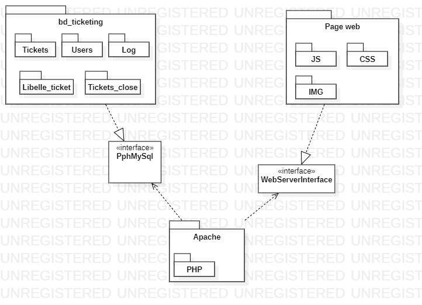
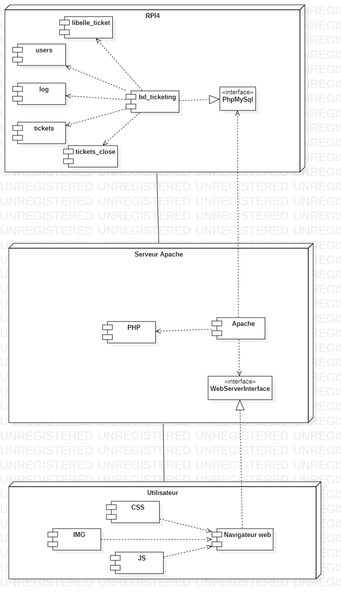

# 
<u> Conception </u>

  

  <blockquote style="text-align: right;">
    Prénoms & Noms des étudiants : 
    Rayan BEN TANFOUS 
    Armand CLOUZEAU 
    Sarah BADER 
    Ismail AKBOULATOV 
    Aymeric PESENTI
  </blockquote>

## [I. Présentation de l'approche](#chap1)
## [II. Style d'architecture](#chap2)
1. [Le Type de Donnée (Abstraction au Domaine)](#chap2.1)
2. [La Topologie (Réduction des Interactions - Couches Utilisateur et Serveur)](#chap2.2)
3. [L'Interaction (Dépendance - Interfaces Définies)](#chap2.3)
4. [La Contrainte (Structure Algorithmique - Client-Serveur)](#chap2.4)
## [III. Diagramme de Package](#chap3)
## [IV. Diagramme de Composants](#chap4)
## [V. Structure du CSS](#chap5)

## <a id="chap1">I. Présentation de l'approche</a>
L'une des étapes cruciales dans le processus de développement logiciel est la conception. Cette phase vise à enrichir la
spécification du logiciel en fournissant une orientation claire pour sa réalisation. La conception est caractérisée par
sa capacité à prendre en compte la plateforme de développement, ce qui implique une réflexion approfondie sur la manière
dont le logiciel interagira avec son environnement.

Pour réaliser la conception, nous suivons une méthode de conception. Ces méthodes guident de manière cohérente le
processus de conception. Elles sont une collection organisée de concepts et de prescriptions, généralement supportées
par des outils informatiques. On les utilise pour développer de façon efficace et systématique.

Dans le cadre de ce projet, nous allons utiliser la méthode de Conception Orientée Objet, qui sera appliquée aussi bien
à la conception architecturale qu'à la conception détaillée. La Conception Orientée Objet est une approche de conception
qui repose sur la représentation des composants du logiciel sous forme d'objets, avec des attributs et des méthodes.
Elle favorise la réutilisation du code, la modularité, et la clarté de la structure logicielle.

La conception architecturale vise à spécifier le système dans son ensemble en identifiant les composants majeurs et en
définissant leurs interfaces. La conception détaillée, quant à elle, se penche sur chaque composant individuellement, en
précisant ses attributs, méthodes, et en élaborant un plan de tests unitaires.

En somme, la conception est le maillon essentiel qui transforme une idée de logiciel en un plan concret pour sa création.
Elle permet de définir la structure globale du système (conception architecturale) et de se plonger dans les détails de
chaque composant (conception détaillée). Cette approche rigoureuse et structurée est cruciale pour garantir que le
logiciel répondra aux exigences et aux attentes des utilisateurs.

---

## <a id="chap2">II. Style d'architecture</a>

Dans le cadre de notre projet de plateforme de ticketing interne, nous allons appliquer un style d'architecture spécifique
qui tient compte des caractéristiques uniques de notre application. Cette approche architecturale prend en compte différents
aspects de notre projet, tels que les types de données, la topologie, les interactions et les contraintes. Voici comment
chaque aspect de l'architecture s'applique à notre projet de ticketing :

1. **Le Type de Donnée (Abstraction au Domaine)** : Notre plateforme de ticketing doit gérer une variété de données
   spécifiques au domaine, telles que les demandes de dépannage, les informations sur les utilisateurs, les statuts des
   tickets, etc. Pour cela, nous devrons concevoir des structures de données appropriées pour représenter ces informations.
   Par exemple, une demande de dépannage peut inclure des données telles que la description du problème, le niveau d'urgence,
   l'utilisateur concerné, le technicien assigné, et bien d'autres. Ces structures de données seront essentielles pour garantir
   une gestion efficace des informations dans notre système.
2. **La Topologie (Réduction des Interactions - Couches Utilisateur et Serveur)** : Dans notre architecture, nous envisageons
   d'adopter une approche en couches pour réduire les interactions directes entre les composants. Nous pouvons diviser notre
   système en deux couches principales : la couche utilisateur et la couche serveur. La couche utilisateur gère les interactions
   avec les utilisateurs, notamment la soumission de demandes de dépannage et la consultation de l'état des tickets. La couche
   serveur est responsable de la gestion des données, de la logique métier, de la communication avec la base de données, et
   de la distribution des demandes aux techniciens. Cette division en couches simplifie la structure du système et facilite
   la maintenance.
3. **L'Interaction (Dépendance - Interfaces Définies)** : Pour garantir des interactions claires entre les composants de
   notre plateforme de ticketing, nous allons définir des interfaces explicites. Par exemple, nous établirons des spécifications
   pour la communication entre la couche utilisateur et la couche serveur, spécifiant les données qui peuvent être échangées
   et les opérations possibles. Les interfaces définies clarifient les attentes en matière d'interactions, ce qui facilite
   le développement, le débogage et la collaboration entre les équipes travaillant sur différentes parties du projet.
4. **La Contrainte (Structure Algorithmique - Client-Serveur)** : Notre architecture repose sur une structure client-serveur.
   Les clients (utilisateurs inscrits, administrateurs web, techniciens) interagissent avec le serveur central, qui est
   responsable de la gestion des demandes, de la persistance des données et de la communication entre les composants.
   Cette approche simplifie la répartition des responsabilités et renforce la sécurité, car la logique métier est centralisée
   et contrôlée par le serveur. La structure client-serveur offre également une base solide pour l'évolutivité future, car
   de nouveaux clients peuvent être ajoutés sans modifier la logique serveur sous-jacente.

En résumé, l'architecture que nous avons choisie pour notre plateforme de ticketing interne est spécialement adaptée aux
besoins de notre projet. Elle prend en compte les données spécifiques au domaine, divise le système en couches utilisateur
et serveur, définit des interfaces claires pour les interactions, et adopte une structure client-serveur pour une gestion
efficace des demandes de dépannage. Cette approche architecturale sera notre guide tout au long du processus de conception
et de développement, en veillant à ce que notre système réponde de manière optimale aux besoins des utilisateurs.

---

## <a id="chap3">III. Diagramme de Package</a>

Le premier élément livrable de notre logiciel est illustré par le diagramme de package. Ce diagramme est d'une importance cruciale, car il forme la base essentielle de notre projet de plateforme de ticketing interne.
À ce stade, notre objectif principal est d'établir des fondations solides pour les futurs modules et fonctionnalités, afin de répondre aux besoins de notre client.

Vous trouverez ci-dessous le diagramme de package :

Le diagramme de package illustre la structure organisationnelle de notre projet logiciel. Il se présente sous la forme
de trois packages principaux qui renferment plusieurs sous-packages, chacun jouant un rôle clé dans notre application.
Ces packages sont :
- **Apache** : Ce package est le point central de notre architecture. Il englobe l'ensemble de notre infrastructure serveur. À l'intérieur de ce package, nous avons un sous-package :
   - **PHP** : Ce sous-package contient les fichiers responsables de la logique serveur. Ces fichiers gèrent le traitement des données, la communication avec la base de données, et d'autres fonctionnalités côté serveur essentielles au bon fonctionnement du système. Il abrite l'ensemble des fichiers PHP nécessaires à notre application.

- **BD (Base de données)** : Ce package est relié au package Apache via une interface **PhpMySQL**. Il contient les différentes bases de données utilisées pour notre application web de ticketing. La connexion entre ces deux packages assure une communication efficace entre la logique serveur et les données stockées.
   - **users** : Ce sous-package spécifique à la base de données contient la table `user` qui regroupe les informations des utilisateurs inscrits sur le site.
   - **tickets** : Ce sous-package spécifique à la base de données contient la table `tickets` qui stocke les informations concernant les tickets des utilisateurs.
   - **libelle_ticket** : Ce sous-package spécifique à la base de données contient la table `libelle_ticket` qui stocke les libellés associés aux différents tickets.
   - **tickets_close** :  Ce sous-package spécifique à la base de données contient la table `tickets_close` qui enregistre les informations sur les tickets qui ont été fermés ou résolus.
   - **log** : Ce sous-package spécifique à la base de données contient la table `log` qui sert à enregistrer les journaux d'activité de l'application.

- **Page web** : Ce package est également connecté au package Apache via une interface **WebServerInterface**. Il est composé de plusieurs sous-packages, chacun ayant un rôle spécifique dans la création de l'interface utilisateur.
   - **CSS** : Le sous-package CSS rassemble les fichiers de feuilles de style en cascade (CSS) qui définissent la présentation visuelle de notre application. Il contribue à assurer une interface utilisateur attrayante et conviviale.
   - **JS (JavaScript)** : Ce sous-package est réservé aux fichiers JavaScript, abritant la logique de programmation côté client. C'est ici que nous développons les fonctionnalités interactives et les comportements dynamiques de notre plateforme.
   - **IMG (Images)** : Dans ce sous-package, nous stockons toutes les images et les ressources visuelles nécessaires à l'interface utilisateur, englobant divers éléments tels que les icônes, les images de fond, et d'autres éléments visuels.

Ce diagramme de package, est essentiel car il définit la structure de base de notre
application web. Il servira de référence pour l'ajout progressif de modules et de fonctionnalités, permettant ainsi à
notre logiciel de croître de manière cohérente et organisée. Notre objectif est de fournir à notre client un logiciel qui
réponde à ses attentes, en commençant par cette première étape cruciale de conception et de structuration.

---

## <a id="chap4">IV. Diagramme de Composants</a>
Notre diagramme de composants offre une vue modulaire de l'architecture de notre plateforme de ticketing interne. Cette représentation est axée sur les différents nœuds composant notre système.

- **RPI4** :
    - **`bd_ticketing`** : Le composant `bd_ticketing` regroupe les différentes bases de données nécessaires au bon fonctionnement de notre application web. BD est relié au composant Apache avec l'interface `PhpMySQL` :
      - **`Users`** : Le composant `Users` représente la base de données des utilisateurs inscrits sur notre site.
      - **`tickets`** : Le composant `tickets` représente la base de données des tickets créé par les utilisateurs.
    - **`PhpMySql`** (interface avec la Base de Données) : Le composant Apache est relié au composant `bd_ticketing` via l'interface `PhpMySQL`. Cette connexion assure une communication efficace entre la logique serveur et les bases de données utilisées pour notre application web de ticketing.

- **Serveur Apache** :
    - **`Apache`** : Le composant Apache est responsable de la gestion du serveur web qui héberge notre application. Ce composant assure la réception des requêtes HTTP, la communication avec le serveur PHP, et la distribution des pages web générées vers les utilisateurs. Il agit comme une passerelle entre le client et le serveur, garantissant le bon fonctionnement de l'ensemble du système.
        - **`PHP`** : Le composant PHP regroupe l'ensemble des scripts PHP responsables de la logique serveur. Ces scripts sont exécutés côté serveur par le module PHP d'Apache, permettant ainsi de générer dynamiquement le contenu des pages web en fonction des requêtes des utilisateurs.
            - **`connexion.php`** : Le composant `connexion.php` est le script PHP qui va permettre de gérer la connexion de l'utilisateur.
            - **`inscription.php`** : Le composant `inscription.php` est le script PHP qui va permettre de gérer l'inscription de l'utilisateur.
            - **`accueil.php`** : Le composant `accueil.php` est le script PHP responsable de la page d'accueil de notre application web.
            - **`utilisateur.php`** : Le composant `utilisateur.php` est le script PHP responsable de la page dédiée aux utilisateurs de notre application web.
            - **`form_connexion_inscription.php`** : Le composant `form_connexion_inscription.php` regroupe deux formulaires, un formulaire de connexion qui va utiliser le script PHP `connexion.php` si l'utilisateur souhaite se connecter, et un second formulaire pour l'inscription qui utilisera le script PHP `inscription.php`. Le formulaire a une feuille de style en CSS qui lui est associée ainsi qu'un script en JavaScript.
            - **`change_password.php`** : Le composant `change_password.php` est le script PHP dédié à la gestion sécurisée du changement de mot de passe des utilisateurs. Il offre une fonctionnalité permettant à l'utilisateur de modifier son mot de passe en toute sécurité.
            - **`form_creation_ticket.php`** : Le composant `form_creation_ticket.php` est le script PHP responsable de recueillir les informations de l'utilisateur lors de la création de son ticket. Il travaille avec le script PHP `action_creation_ticket.php` qui incrémente le ticket dans la base de données.
            - **`action_creation_ticket.php`** : Le composant `action_creation_ticket.php` est responsable de l'ajout du ticket de l'utilisateur dans la base de données.
            - **`action_cloturer_ticket.php`** : Le composant `action_cloturer_ticket.php` est responsable de la logique permettant de clôturer ou résoudre un ticket dans la base de données. Il intervient lorsque l'utilisateur souhaite fermer un ticket.
            - **`action_creation_libelle.php`** : Le composant `action_creation_libelle.php` est responsable de l'ajout de nouveaux libellés dans la base de données. Il est utilisé en conjonction avec la page `page_creation_libelle.php`, permettant à l'administrateur d'ajouter de nouvelles catégories de tickets.
            - **`action_page_technicien.php`** : Le composant `action_page_technicien.php` gère les actions spécifiques liées à la page destinée aux techniciens. Il peut inclure la gestion des tickets attribués aux techniciens et d'autres fonctionnalités spécifiques à leur rôle.
            - **`action_update_ticket_adm_web.php`** : Le composant `action_update_ticket_adm_web.php` est responsable de la mise à jour des informations d'un ticket par l'administrateur web. Il intervient lorsque des modifications sont apportées à un ticket depuis la page d'administration web.
            - **`authentification.php`** : Le composant `authentification.php` est utilisé avec le composant `connexion.php`. Il permet de rediriger l'utilisateur vers la page appropriée en fonction de son rôle.
            - **`ChangePassword.php`** : Le composant `ChangePassword.php` est présent pour permettre à l'utilisateur de modifier son mot de passe.
            - **`Config.php`** : Le composant`Config.php` travail avec le composant `log.php`. Il permet d'écrire dans les logs.
            - **`form_creation_technicien.php`** : Le composant `form_creation_technicien.php` est utile pour l'administrateur web, car il a notamment pour rôle de créer de nouveaux techniciens.
            - **`page_adm_systeme_log.php`** : Le composant `page_adm_systeme_log.php` permet d'afficher un tableau contenant les logs dans la page de l'administrateur systeme.
            - **`page_adm_web.php`** : Le composant `page_adm_web.php` affiche la page de l'administrateur web.
            - **`page_adm_web_traitement_ticket.php`** : Le composant `page_adm_web_traitement_ticket.php` permet à l'administration web de gerer les tickets des utilisateurs.
            - **`page_admin_systeme.php`** : Le composant `page_admin_systeme.php` affiche la page de l'administrateur système .
            - **`page_creation_libelle.php`** : Le composant `page_creation_libelle.php` permet à l'administrateur web de créer de nouveaux libellé pour les tickets.
            - **`page_details_ticket.php`** : Le composant `page_details_ticket.php` est utilisée pour afficher des détails spécifiques sur un ticket voulu.
            - **`page_technicien.php`** : Le composant `page_technicien.php` est utilisée pour afficher l'interface des techniciens.
            - **`profil.php`** : Le composant `profil.php` est utilisée pour afficher et gérer le profil de l'utilisateur connecté.
            - **`RC4.php`** : Le composant `RC4.php` implémente l'algorithme de chiffrement RC4. On l'utilise pour chiffrer les mots de passe.

            - **`WebServerInterface`** (interface avec le Navigateur Web) : Le composant Apache est également relié au composant Navigateur Web via l'interface `WebServerInterface`. Cette liaison permet une interaction fluide entre le serveur et le navigateur web des utilisateurs, assurant ainsi une expérience utilisateur optimale.

- **Utilisateur** :
    - **`Navigateur web`** : Responsable de l'affichage des pages web générées par le serveur Apache. Il interprète le code HTML, CSS, et JavaScript pour présenter le contenu de manière conviviale aux utilisateurs.
    - **`CSS`** : Composant responsable de la mise en forme et du style des pages web.
        - **`style_accueil.css`** : Feuille de style appliquée à la page `accueil.php`, définissant l'apparence de la page d'accueil de l'application.
        - **`style_utilisateur.css`** : Feuille de style appliquée à la page `utilisateur.php`, définissant l'apparence de la page dédiée aux utilisateurs.
        - **`form_connexion_inscription.css`** : Feuille de style appliquée aux formulaires dans `form_connexion_inscription.php`.
        - **`style_from_ticket.css`** : Feuille de style appliquée aux formulaires du script php `form_creation_ticket.php`.
        - **`style_page_adm_systeme.css`** : Feuille de style appliquée à la page `page_admin_systeme.php`.
        - **`style_page_adm_traitement_ticket.css`** : Feuille de style appliquée à la page `page_adm_web_traitement_ticket.php`.
        - **`style_page_details_ticket.css`** : Feuille de style appliquée à la page `page_details_ticket.php`.
        - **`style_volet_information.css`** : Feuille de style appliquée au script JS.
    - **`JS`** : Composant responsable de la logique interactive et dynamique des pages web.
        - **`form_connexion_inscription.js`** : Script JavaScript utilisé dans `form_connexion_inscription.php`, fournissant des fonctionnalités interactives aux formulaires.
    - **`IMG`** : Composant responsable du chargement et de l'affichage des images sur les pages web.
        - **`logo.png`** : Image représentant le logo de l'application, utilisée dans l'interface utilisateur pour une identification visuelle.

Cette répartition modulaire simplifie la structure en identifiant les éléments principaux de chaque nœud. Ainsi, le RPI4 héberge la base de données et l'interface avec celle-ci, tandis que le Serveur Apache centralise les composants essentiels à la gestion du serveur web et de l'interface utilisateur via le WebServerInterface.

Cette vue modulaire nous permet de mieux comprendre les interactions entre les différents éléments de notre système, tout en facilitant la gestion et la maintenance de chaque composant.

---

## V. Structure du CSS

Chaque page web de notre projet possède sa propre feuille de style CSS, adaptée spécifiquement à son contexte. Chaque feuille de style est conçue en respectant la charte graphique du projet établie au préalable, garantissant ainsi une cohérence visuelle et esthétique.

### Accueil (`accueil.php`)

- Utilisation de `style_accueil.css` pour la mise en page spécifique tout en maintenant l'harmonie avec la palette globale du projet.

### Utilisateur (`utilisateur.php`)

- Stylisation de la page utilisateur avec `style_utilisateur.css`, respectant les principes de design établis pour le projet.

### Script PHP contenant les formulaires de connexion et d'inscription (`form_connexion_inscription.php`)

- Utilisation de `form_connexion_inscription.css` pour garantir une apparence uniforme des formulaires en accord avec le reste du projet.

### Script PHP pour créer un ticket (`form_creation_ticket.php`)

- La feuille de style `style_form_creation_ticket.css` est utilisée pour assurer la présentation esthétique de ce processus, reprenant les styles des formulaires précédents tout en apportant de nouvelles innovations.

### Script PHP dédié au changement de mot de passe (`change_password.php`)

- Le script PHP `change_password.php` est associé à la feuille de style `style_change_password.css`. Cette feuille de style spécifique assure la présentation cohérente et esthétique de la fonction de changement de mot de passe.

### Script PHP pour la création de techniciens (`form_creation_technicien.php`)

- Le script PHP `form_creation_technicien.php` est utile pour l'administrateur web, car il a notamment pour rôle de créer de nouveaux techniciens.
