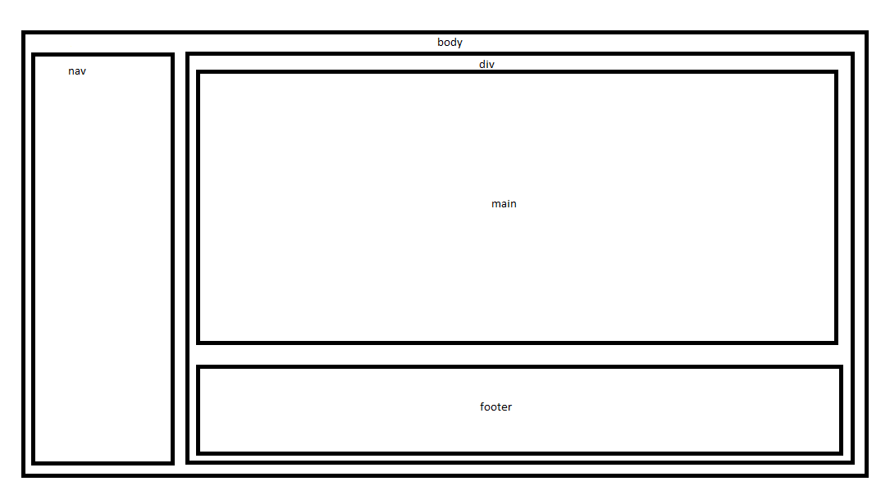
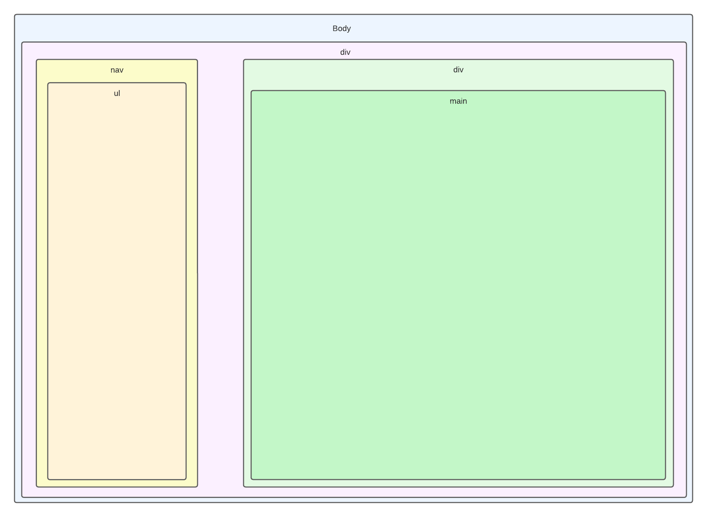

# 
<u>Spécification</u>

  

  <blockquote style="text-align: right;">
    Prénoms & Noms des étudiants : 
    Rayan BEN TANFOUS 
    Armand CLOUZEAU 
    Sarah BADER 
    Ismail AKBOULATOV 
    Aymeric PESENTI
  </blockquote>

# 
<u>Table des Matières</u>

## [I. Maquette de la page d'accueil visiteur](#chap1)
## [II. Maquette de la page utilisateur](#chap2)
## [III. Généralisation des maquettes](#chap3)
## [IV. La charte graphique du site](#chap4)
## [V. Présentation du logo de notre plateforme web](#chap5)
## [VI. Cas d'utilisation pris en compte dans les livrables](#chap6)
## [VII. Navigation des pages](#chap7)

---

Dans ce document, nous allons présenter les maquettes des pages web statiques pour l'accueil des visiteur. Ces maquettes sont conçues pour illustrer la structure des pages, y compris les éléments clés tels que la navigation, le contenu principal et les pieds de page.

## I. Maquette de la page d'accueil visiteur

### Section de Contenu Principal

La section de contenu principal contient un texte explicatif sur le principe du ticketing ainsi qu'une vidéo démonstration sur comment utiliser l'application web et un tableau présentant les 10 dernières demandes faites sur la plateforme.

### Barre Latérale

La barre latérale à droite de la page comprend le logo du site, le titre de la page, un menu de navigation et l'identité de l'utilisateur, c'est à dire "visiteur".
### Pied de Page

Le pied de page contient des informations de contact, des liens vers les médias sociaux, et un formulaire d'abonnement à la newsletter. Il permet aux utilisateurs de rester en contact avec le site et de recevoir des mises à jour régulières.

### La Maquette

---

## II. Maquette de la page utilisateur

### Section de Contenu Principal

La section de contenu principal contient un message de bienvenue pour l’utilisateur en haut de page, puis l’historique des tickets de l’utilisateur

### Barre Latérale

La barre latérale à droite de la page comprend le logo du site, un bouton d’accès à la page d’accueil, un bouton de création d’un nouveau ticket, un lien de navigation vers l’historique et enfin un bouton de déconnexion.Le bouton de déconnexion renvoi à la page de connexion.

### Maquette de la page utilisateur

---

## III. Généralisation des maquettes

Suite à nos discussions lors de la conception de notre site, nous avons décidé de simplifier les choses en adoptant une 
structure standard pour la plupart de nos pages. L'idée est d'offrir à tout le monde une expérience de navigation 
uniforme et facile. Nous avons choisi de suivre le modèle de la page utilisateur qui est adapté. Donc, toutes les pages 
vont maintenant avoir plus ou moins le même format, avec pour seule différence le contenu dans la balise `<main>`. Cela va
rendre la navigation plus claire, le contenu plus lisible, et de plus, cela va simplifier le développement et l'entretien
du site. Nous sommes convaincus qu'ainsi l'utilisation du site sera plus simple, plus cohérente et pratique pour tout le
monde.

---

## IV. La charte graphique du site

### 1) Visée esthétique du site :
La visée esthétique du site est guidée par une série de choix délibérés en ce qui concerne les couleurs, la typographie,
les formes et les images. Le choix du bleu vif pour les arrière-plans, les bordures et les éléments de navigation est
motivé par son association à la confiance, la fiabilité et la sérénité, visant ainsi à créer une atmosphère rassurante
pour les visiteurs. Le blanc, utilisé pour l'arrière-plan principal, les zones de texte et les espaces vides, renforce
l'idée de propreté, de simplicité et d'épure. Enfin, l'orange est utilisé stratégiquement pour mettre en évidence les
éléments importants tels que les boutons et les appels à l'action, en évoquant l'énergie, l'enthousiasme et l'attention.

La typographie, avec des majuscules claires pour une lisibilité optimale, renforce la dimension professionnelle du site.
La police principale, telle qu'Arial ou Helvetica, évoque la clarté et la netteté, tandis que Montserrat, utilisée pour
les titres, apporte une touche de modernité et de clarté.

Les formes géométriques simples créent une esthétique épurée, tout en incorporant des éléments graphiques aux angles
arrondis pour introduire une convivialité et un dynamisme. La mise en page équilibrée et responsive garantit une
expérience utilisateur optimale, s'adaptant aux différents appareils et résolutions d'écran. Des nuances de bleu sont
utilisées pour créer une hiérarchie visuelle, mettant en évidence les éléments clés du site.

Les images de haute qualité, en harmonie avec la palette de couleurs, renforcent l'ambiance globale du site.
Les images intégrant des éléments orange et bleu contribuent à renforcer la cohérence visuelle.
Enfin, les éléments interactifs, mis en évidence par l'orange, assurent une expérience utilisateur fluide et agréable.

### 2) Forme visuelle du site :
La forme visuelle du site exprime des idées et des valeurs précises. Le choix du bleu évoque la confiance et la
fiabilité, ce qui suggère que le site offre des informations ou des services dignes de confiance.
La sérénité associée au bleu renforce l'idée d'une expérience utilisateur apaisante et agréable. Le blanc,
symbole de pureté et de simplicité, véhicule l'idée de transparence et de clarté. Il indique que le site présente
des informations de manière directe et compréhensible, sans artifices inutiles.

L'orange, utilisé de manière sélective pour mettre en évidence des éléments importants, reflète l'énergie et
l'enthousiasme. Cela suggère que le site encourage l'action et l'engagement de la part des visiteurs. L'orange attire
l'attention vers les points essentiels, renforçant ainsi l'idée de pertinence et d'impact.

La typographie soigneusement choisie renforce l'idée de professionnalisme et de clarté, indiquant que le site est
sérieux dans sa communication. Les formes géométriques simples et les angles arrondis créent une harmonie visuelle
qui évoque l'équilibre et la convivialité, suggérant que le site est accueillant et facile à utiliser.

En résumé, la visée esthétique du site véhicule l'idée de confiance, de clarté, d'énergie et de convivialité.
Il encourage l'action tout en offrant une expérience utilisateur apaisante. Ces choix visuels renforcent l'image du
site en tant que source fiable et engageante d'informations ou de services.

---

## V. Présentation du logo de notre plateforme web

### 1) Logo écusson RCORP

#### A) Présentation graphique du logo :
Pour réaliser graphiquement le 1er logo, nous avons utilisé l’application en ligne gratuite Canva.
En effet, Canva est un outil de conception graphique convivial et complet qui permet de créer des graphiques,
des logos, des affiches, et bien plus encore. Nous avons utilisé sa vaste bibliothèque de modèles, de formes,
de polices et d'images pour créer notre logo.

#### B) Description du logo :
Le premier logo proposé pour "Rayan's Ticket" est distinct et visuellement frappant. Il comporte un cercle central
qui renferme un symbole représentant ce qui semble être un billet. Ce symbole est conçu dans un bleu électrique vif,
qui ressort de manière significative sur un arrière-plan simple et discret. Le texte du logo est également
particulièrement stylisé, avec les mots "Rayan's Ticket" et "RCorp" clairement écrits. Les formes du logo se
concentrent principalement sur des éléments géométriques, avec un fort contraste entre le cercle et les lettres,
créant ainsi un équilibre visuel intéressant.

#### C) Explication de l'expression visuelle du logo :
Visuellement, ce logo exprime une combinaison d'éléments clés qui le rendent adapté à une entité de billetterie
comme "Rayan's Ticket". Le cercle central, contenant un symbole qui évoque un billet, indique immédiatement l'objectif
de l'entreprise, qui est la vente de billets. Le choix du bleu électrique vif apporte une impression d'énergie et de
dynamisme, ce qui est important pour une entreprise de billetterie qui souhaite créer de l'enthousiasme chez ses
clients. De plus, la typographie stylisée renforce l'identité de la marque, créant un aspect professionnel et mémorable.
L'absence de visages, de points de repère ou de célébrités dans l'image met l'accent sur le logo lui-même, suggérant que
"Rayan's Ticket" est centrée sur l'expérience de l'achat de billets plutôt que sur des éléments extérieurs.
Enfin, la simplicité du design contribue à sa mémorabilité, ce qui en fait un emblème approprié pour un service
de billetterie qui vise à être à la fois facile à retenir et reconnaissable. L'ensemble du logo évoque donc une marque
déposée de qualité et d'exclusivité, tout en étant accrocheur et en mettant l'accent sur l'essentiel :
l'achat de billets de manière simple et efficace.

---

### Conclusion

Nous avons réalisé ce logo pour notre site, mettant en avant les qualités du bleu qui évoque davantage la confiance. 
Son esthétique professionnelle, semblable à un écusson, a été le critère déterminant dans notre choix. De plus, il a 
fait l'unanimité au sein du groupe de projet, renforçant ainsi la conviction que ce logo correspond le mieux à l'image 
de confiance et de professionnalisme que nous souhaitons pour notre entreprise de billetterie.

***

## VI. Cas d'utilisation pris en compte dans les livrables

| Nom : Afficher la page web                                                                                                                                                               |
|----------------------------------------------------------------------------------------------------------------------------------------------------------------------------------------------------------|
| **Contexte d’utilisation** :  Visualisation de la page web de la plateforme de ticketing interne                                                                                                         |
| **Portée** : Boîte Noire                                                                                                                                                                                 |
| **Niveau** : Stratégique                                                                                                                                                                                 |
| **Acteurs** : Utilisateurs                                                                                                                                                                               |
| **Préconditions** : Lancer la page web                                                                                                                                                                   |
| **Garantie minimale** : Le système garantit que les utilisateurs peuvent visualiser la page web de la plateforme de ticketing interne.                                                                   |
| **Déclencheur** : Connexion de l'utilisateur                                                                                                                                                             |
| **Scénario** :   1.L'utilisateur  accède à la page web de la plateforme de ticketing.   2. Le système affiche la page d'accueil de la plateforme de ticketing avec les informations pertinentes. |
| **Exception** :  - Si des problèmes techniques surviennent et empêchent l'affichage de la page web.                                                                                                  |

***

| Nom : S’inscrire                                                                                                                                                                                                                              |
|-------------------------------------------------------------------------------------------------------------------------------------------------------------------------------------------------------------------------------------------------------------|
| **Contexte d’utilisation** : Les visiteurs doivent pouvoir s’inscrire.                                                                                                                                                                                      |
| **Portée** : Boîte blanche                                                                                                                                                                                                                                  |
| **Niveau** : Utilisateur                                                                                                                                                                                                                                    |
| **Acteurs** : Utilisateur                                                                                                                                                                                                                                   |
| **Préconditions** : Pas encore utilisateur                                                                                                                                                                                                                  |
| **Garantie minimale** : Le système garantit que l'inscription est complète et que le nouvel utilisateur peut accéder à son compte.                                                                                                                          |
| **Déclencheur** : L'utilisateur souhaite créer un compte pour accéder aux fonctionnalités de la plateforme.                                                                                                                                                 |
| **Scénario** :  &nbsp;&nbsp;&nbsp;&nbsp;1.Vérifier l’appartenance du login à la base de donnée.  &nbsp;&nbsp;&nbsp;&nbsp;2. Récupération du login et du mot de passe. &nbsp;&nbsp;&nbsp;&nbsp;3. Ajout de l’utilisateur dans la base de donnée. |
| **Exception** :   &nbsp;&nbsp;&nbsp;&nbsp;- Login déjà utilisée.  &nbsp;&nbsp;&nbsp;&nbsp;- Refus de l’inscription                                                                                                                                  |

***

| Nom : Déconnexion                                                                  |
|---------------------------------------------------------------------------------------------------|
| **Contexte d’utilisation** : Utilisateur veut se déconnecter de la plateforme                     |
| **Portée** : Boite blanche                                                                        |
| **Niveau** : Sous-fonction                                                                        |
| **Acteur** : Utilisateur                                                                          |
| **Précondition** : Être connecter a la plateforme en tant qu'utilisateur                          |
| **Garantie minimale** : Rien ne se passe                                                          |
| **Déclencheur** : utilisateur clique sur le bouton déconnexion                                    |
| **Scénario nominal** : 1.Suppression du fichier de session.  2.Retour à la page de login. |

***

| Nom : Se connecter                                                                                                                                                |
|----------------------------------------------------------------------------------------------------------------------------------------------------------------------------------|
| **Contexte d’utilisation** : utilisateur déjà inscrit veut accéder à la plateforme via son compte                                                                                |
| **Portée** : Boîte blanche                                                                                                                                                       |
| **Niveau** : Sous-fonction                                                                                                                                                       |
| **Acteur** : utilisateur                                                                                                                                                         |
| **Précondition** : être inscrit en tant qu'utilisateur                                                                                                                           |
| **Garantie minimale** : *trouver un truc a mettre*                                                                                                                               |
| **Déclencheur** : utilisateur a entré son identifiant et son mot de passe sur la page de login                                                                                   |
| **Scénario nominal** : 1.Vérification du remplissage du formulaire de connexion. 2.Identification de l'utilisateur. 3.Accès à la plateforme en tant qu'utilisateur   |
| **Exception** : Formulaire vide ou données incorrectes:  &nbsp;&nbsp;&nbsp;&nbsp;Renvoi à la page de login avec message d'erreur "identifiant ou mot de passe incorrect" |

***

| Nom : Gérer les demandes de dépannage                                                                                                |
|----------------------------------------------------------------------------------------------------------------------------------------------------|
| **Contexte d’utilisation** :  L’application web doit gérer les demandes de dépannage des différents utilisateurs                                   |
| **Portée** : Entreprise                                                                                                                            |
| **Niveau** : Stratégique                                                                                                                           |
| **Acteurs** : Utilisateurs                                                                                                                         |
| **Préconditions** : utilisateur inscrit                                                                                                            |
| **Garantie minimale** : suivre le ticket de dépannage de l’utilisateur                                                                             |
| **Déclencheur** : événement interne (création d’un ticket de dépannage)                                                                            |
| **Scénario** :   1.Vérifier que l'utilisateur est inscrit.   2. Identification de l’utilisateur.  3.Gérer la demande de l’utilisateur. |
| **Exception** :  - Utilisateur non inscrit :   &nbsp;&nbsp;&nbsp;&nbsp;Refuser la demande                                                  |

***

| Nom : Recueillir les demandes                                                                                                                                                     |
|-------------------------------------------------------------------------------------------------------------------------------------------------------------------------------------------------|
| **Contexte d’utilisation** :  L’application web doit recueillir les demandes de dépannage des différents utilisateurs                                                                           |
| **Portée** : Entreprise                                                                                                                                                                         |
| **Niveau** : Stratégique                                                                                                                                                                        |
| **Acteurs** : Administrateurs                                                                                                                                                                   |
| **Préconditions** : une demande ait été créé par un utilisateur inscrit                                                                                                                         |
| **Garantie minimale** : le système garantit que les demandes des utilisateurs seront recueillies et stockées dans une base de données.                                                          |
| **Déclencheur** : événement interne (création d’un ticket de dépannage)                                                                                                                         |
| **Scénario** :   1.Vérifier que l’utilisateur est inscrit.   2. Identification de l’utilisateur.  3.Recueillir la demande de l’utilisateur en la stockant dans une base de données. |
| **Exception** :  - Utilisateur non inscrit : Refuser la demande                                                                                                                             |

***

| Nom : Création de Ticket                                                                                                                                                                                                                                                                                                                                                                                                                                                                                                                                                                                                                                                                                                                                                                                                                                                                                                                                                                        |
|---------------------------------------------------------------------------------------------------------------------------------------------------------------------------------------------------------------------------------------------------------------------------------------------------------------------------------------------------------------------------------------------------------------------------------------------------------------------------------------------------------------------------------------------------------------------------------------------------------------------------------------------------------------------------------------------------------------------------------------------------------------------------------------------------------------------------------------------------------------------------------------------------------------------------------------------------------------------------------------------------------------|
| **Contexte d’utilisation** : Demande de dépannage technique dans l'université.                                                                                                                                                                                                                                                                                                                                                                                                                                                                                                                                                                                                                                                                                                                                                                                                                                                                                                                                |
| **Portée** : Boîte noire                                                                                                                                                                                                                                                                                                                                                                                                                                                                                                                                                                                                                                                                                                                                                                                                                                                                                                                                                                                      |
| **Niveau** : Utilisateur                                                                                                                                                                                                                                                                                                                                                                                                                                                                                                                                                                                                                                                                                                                                                                                                                                                                                                                                                                                      |
| **Acteurs** : Utilisateur Inscrit                                                                                                                                                                                                                                                                                                                                                                                                                                                                                                                                                                                                                                                                                                                                                                                                                                                                                                                                                                             |
| **Préconditions** : L'utilisateur doit être authentifié dans le système.                                                                                                                                                                                                                                                                                                                                                                                                                                                                                                                                                                                                                                                                                                                                                                                                                                                                                                                                      |
| **Garantie minimale** : Le ticket est créé                                                                                                                                                                                                                                                                                                                                                                                                                                                                                                                                                                                                                                                                                                                                                                                                                                                                                                                                                                    |
| **Déclencheur** : L'utilisateur identifie un besoin d'assistance technique ou signale un problème.                                                                                                                                                                                                                                                                                                                                                                                                                                                                                                                                                                                                                                                                                                                                                                                                                                                                                                            |
| **Scénario** :   &nbsp;&nbsp;&nbsp;&nbsp;1.L'utilisateur sélectionne l'option "Créer un Ticket" depuis son tableau de bord.   &nbsp;&nbsp;&nbsp;&nbsp;2. Le système affiche un formulaire de création de ticket.   &nbsp;&nbsp;&nbsp;&nbsp;3. L'utilisateur remplit le formulaire en fournissant les informations suivantes :   &nbsp;&nbsp;&nbsp;&nbsp;&nbsp;&nbsp;&nbsp;&nbsp;&nbsp;&nbsp;&nbsp;&nbsp;- Description détaillée du problème ou de la demande.  &nbsp;&nbsp;&nbsp;&nbsp;&nbsp;&nbsp;&nbsp;&nbsp;&nbsp;&nbsp;&nbsp;&nbsp;- Libellé du problème (choisi parmi les libellés prédéfinis).   &nbsp;&nbsp;&nbsp;&nbsp;&nbsp;&nbsp;&nbsp;&nbsp;&nbsp;&nbsp;&nbsp;&nbsp;- Priorité de la demande (choisie parmi les options : faible, moyen, important, urgent).   &nbsp;&nbsp;&nbsp;&nbsp;&nbsp;&nbsp;&nbsp;&nbsp;&nbsp;&nbsp;&nbsp;&nbsp;- Niveau d'urgence (choisi parmi les options : 4, 3, 2, 1).  &nbsp;&nbsp;&nbsp;&nbsp;4. L'utilisateur soumet le formulaire. |
| **Exception** :   - Utilisateur non authentifier                                                                                                                                                                                                                                                                                                                                                                                                                                                                                                                                                                                                                                                                                                                                                                                                                                                                                                                                                          |

***

| Nom : Visualiser tableau de bord                                                                                                                                                                  |
|-----------------------------------------------------------------------------------------------------------------------------------------------------------------------------------------------------------------|
| **Contexte d’utilisation** : L'utilisateur inscrit pourra visualiser sur sa page utilisateur les derniers tickets qu'il a créés.                                                                                 |
| **Portée** : Boîte blanche                                                                                                                                                                                      |
| **Niveau** : Utilisateur                                                                                                                                                                                        |
| **Acteurs** : Utilisateur                                                                                                                                                                                       |
| **Préconditions** : Authentifié en tant qu’utilisateur du tableau de bord correspondant                                                                                                                         |
| **Garantie minimale** : Le système garantit que l'utilisateur peut accéder à son tableau de bord et visualiser les informations essentielles.                                                                   |
| **Déclencheur** : Connexion au profil d’un utilisateur                                                                                                                                                          |
| **Scénario** :  &nbsp;&nbsp;&nbsp;&nbsp;1.Connexion de l’utilisateur  &nbsp;&nbsp;&nbsp;&nbsp;2. Visualisation du tableau de bord sur la page                                                           |
| **Exception** :   &nbsp;&nbsp;&nbsp;&nbsp;- Si l'utilisateur n'est pas authentifié dans le système (par exemple, en cas de déconnexion involontaire), le système renvoie l'utilisateur à la page d'accueil. |

***

| **Nom** : Visualiser profil                                                                                 |
|----------------------------------------------------------------------------------------------------------------------------|
| **Contexte d’utilisation** : Utilisateur vient de réussir à se connecter                                                   |
| **Portée** : Boîte blanche                                                                                                 |
| **Niveau** : Utilisateur                                                                                                   |
| **Acteur** : Utilisateur                                                                                                   |
| **Précondition** :  Avoir réussi à se connecter avec ses identifiants                                                      |
| **Garantie minimale** : *trouver un truc a mettre*                                                                         |
| **Déclencheur** : *trouver un truc a mettre*                                                                               |
| **Scénario nominal** : 1.Cliquer sur bouton d'accès au profil. 2.Visualiser les données sur le profil utilisateur. |
| **Exception** :  Une personne n'étant pas inscrit ne pourra pas visualiser son profil                                      |

***

| Nom : Modifier son mot de passe                                                                                                                                                |
|-----------------------------------------------------------------------------------------------------------------------------------------------------------------------------------------------|
| **Contexte d’utilisation** : utilisateur veut modifier son mot de passe de connexion                                                                                                          |
| **Portée** : Boite blanche                                                                                                                                                                    |
| **Niveau** : Utilisateur                                                                                                                                                                      |
| **Acteur** : Utilisateur                                                                                                                                                                      |
| **Précondition** : être connecter a la plateforme en tant qu'utilisateur                                                                                                                      |
| **Garantie minimale** : rien ne se passe                                                                                                                                                      |
| **Déclencheur** : utilisateur clique sur le bouton de modification de mot de passe                                                                                                            |
| **Scénario nominal** : 1.Utilisateur donne son mot de passe actuel.  2.Utilisateur inscrit son nouveau mot de passe 2 fois pour valider. 3.Mot de passe de l'utilisateur modifié. |
| **Exception** : Mot de passe actuel donnée invalide:   &nbsp;&nbsp;&nbsp;&nbsp;- Refus de la demande avec message d'erreur " le mot de passe actuel fourni est incorrect".            |

***

| Nom : Administrer les demandes                                                                                                                                                                |
|-------------------------------------------------------------------------------------------------------------------------------------------------------------------------------------------------------------|
| **Contexte d’utilisation** : L’administrateur web et les techniciens doivent pouvoir administrer les différentes demandes des utilisateurs                                                                  |
| **Portée** : Entreprise                                                                                                                                                                                     |
| **Niveau** : Stratégique                                                                                                                                                                                    |
| **Acteurs** : Administrateur web, techniciens                                                                                                                                                               |
| **Préconditions** : authentifié en tant qu'administrateur web ou technicien                                                                                                                                 |
| **Garantie minimale** : le système garantit que les demandes des utilisateurs seront recueillies et stockées dans une base de données.                                                                      |
| **Déclencheur** : l’administrateur web ou le technicien souhaitent modifier des informations concernant le ticket de dépannage d’un utilisateur.                                                            |
| **Scénario 1** :   &nbsp;&nbsp;&nbsp;&nbsp;1.Un ticket est créé.   &nbsp;&nbsp;&nbsp;&nbsp;2. Un administrateur web l’attribue à un technicien.                                                     |
| **Scénario 2** :   &nbsp;&nbsp;&nbsp;&nbsp;1.Un ticket est créé.   &nbsp;&nbsp;&nbsp;&nbsp;2.Un technicien se l’attribue.                                                                           |
| **Scénario 3** :   &nbsp;&nbsp;&nbsp;&nbsp;1.Un ticket est créé.   &nbsp;&nbsp;&nbsp;&nbsp;2.Un administrateur web en modifie le statut. &nbsp;&nbsp;&nbsp;&nbsp;3.Un technicien se l’attribue. |
| **Exception** :  Ticket fermé :  &nbsp;&nbsp;&nbsp;&nbsp;- Refuser la demande.  Authentifier en tant qu’utilisateur :  &nbsp;&nbsp;&nbsp;&nbsp;- Impossible d'administrer une demande.      |

***

| Nom : Stocker dans le Journal d'Activité                                                                                                                                                                                                                                                                                                                                                                                                                                                                                                                                                                                                                                                                                                                                                                                                                                                           |
|------------------------------------------------------------------------------------------------------------------------------------------------------------------------------------------------------------------------------------------------------------------------------------------------------------------------------------------------------------------------------------------------------------------------------------------------------------------------------------------------------------------------------------------------------------------------------------------------------------------------------------------------------------------------------------------------------------------------------------------------------------------------------------------------------------------------------------------------------------------------------------------------------------------|
| **Contexte d’utilisation** : Enregistrement d'une nouvelle création de ticket.                                                                                                                                                                                                                                                                                                                                                                                                                                                                                                                                                                                                                                                                                                                                                                                                                                   |
| **Portée** : Boîte blanche                                                                                                                                                                                                                                                                                                                                                                                                                                                                                                                                                                                                                                                                                                                                                                                                                                                                                       |
| **Niveau** : Sous-fonction                                                                                                                                                                                                                                                                                                                                                                                                                                                                                                                                                                                                                                                                                                                                                                                                                                                                                       |
| **Acteurs** : Utilisateurs                                                                                                                                                                                                                                                                                                                                                                                                                                                                                                                                                                                                                                                                                                                                                                                                                                                                                       |
| **Préconditions** : Un ticket a été créé avec succès dans le système.                                                                                                                                                                                                                                                                                                                                                                                                                                                                                                                                                                                                                                                                                                                                                                                                                                            |
| **Garantie minimale** : Le système garantit que les informations pertinentes de la création de ticket sont stockées dans le journal d'activité.                                                                                                                                                                                                                                                                                                                                                                                                                                                                                                                                                                                                                                                                                                                                                                  |
| **Déclencheur** : Un utilisateur crée un nouveau ticket dans le système.                                                                                                                                                                                                                                                                                                                                                                                                                                                                                                                                                                                                                                                                                                                                                                                                                                         |
| **Scénario 1** :  Un utilisateur authentifié crée un nouveau ticket en utilisant le système:  &nbsp;&nbsp;&nbsp;&nbsp;1.Le système enregistre automatiquement les informations suivantes dans le journal d'activité :  &nbsp;&nbsp;&nbsp;&nbsp;&nbsp;&nbsp;&nbsp;&nbsp;&nbsp;&nbsp;&nbsp;&nbsp;- Date et heure de création du ticket.  &nbsp;&nbsp;&nbsp;&nbsp;&nbsp;&nbsp;&nbsp;&nbsp;&nbsp;&nbsp;&nbsp;&nbsp;- Adresse IP de l'utilisateur qui a créé le ticket.  &nbsp;&nbsp;&nbsp;&nbsp;&nbsp;&nbsp;&nbsp;&nbsp;&nbsp;&nbsp;&nbsp;&nbsp;- Nom d'utilisateur (login) qui a formulé le ticket.  &nbsp;&nbsp;&nbsp;&nbsp;&nbsp;&nbsp;&nbsp;&nbsp;&nbsp;&nbsp;&nbsp;&nbsp;- Niveau d'urgence du ticket.  &nbsp;&nbsp;&nbsp;&nbsp;2. Le journal d'activité enregistre ces informations pour permettre une analyse ultérieure et une surveillance de l'activité de création de tickets. |
| **Scénario 2** :  Si il y a une tentative de connexion infructueuse:  &nbsp;&nbsp;&nbsp;&nbsp;1.Le système enregistre automatiquement les informations suivantes dans le journal d'activité :  &nbsp;&nbsp;&nbsp;&nbsp;&nbsp;&nbsp;&nbsp;&nbsp;&nbsp;&nbsp;&nbsp;&nbsp;- La date.  &nbsp;&nbsp;&nbsp;&nbsp;&nbsp;&nbsp;&nbsp;&nbsp;&nbsp;&nbsp;&nbsp;&nbsp;- L'adresse IP.  &nbsp;&nbsp;&nbsp;&nbsp;&nbsp;&nbsp;&nbsp;&nbsp;&nbsp;&nbsp;&nbsp;&nbsp;- Le nom d'utilisateur tenté.  &nbsp;&nbsp;&nbsp;&nbsp;&nbsp;&nbsp;&nbsp;&nbsp;&nbsp;&nbsp;&nbsp;&nbsp;- Le mot de passe tenté.  &nbsp;&nbsp;&nbsp;&nbsp;2. Le journal d'activité enregistre ces informations pour permettre une analyse ultérieure et une surveillance de l'activité de création de tickets.                                                                                                                    |
| **Exception** :   &nbsp;&nbsp;&nbsp;&nbsp;- Aucune exception                                                                                                                                                                                                                                                                                                                                                                                                                                                                                                                                                                                                                                                                                                                                                                                                                                                 |

***

| Nom : Modifier le Statut                                                                                                                                                                                                                                                                                                                                                                                                                                                            |
|------------------------------------------------------------------------------------------------------------------------------------------------------------------------------------------------------------------------------------------------------------------------------------------------------------------------------------------------------------------------------------------------------------------------------------------------------------------------------------------------------------|
| **Contexte d’utilisation** : Gestion des tickets dans le système de gestion des demandes.                                                                                                                                                                                                                                                                                                                                                                                                                  |
| **Portée** : Boîte noire                                                                                                                                                                                                                                                                                                                                                                                                                                                                                   |
| **Niveau** : Sous-fonction                                                                                                                                                                                                                                                                                                                                                                                                                                                                                 |
| **Acteurs** : Administrateur Web                                                                                                                                                                                                                                                                                                                                                                                                                                                                           |
| **Préconditions** : L'administrateur web doit être authentifié dans le système.                                                                                                                                                                                                                                                                                                                                                                                                                            |
| **Garantie minimale** : Le système garantit que le statut du ticket est modifié avec succès dans la base de données du système.                                                                                                                                                                                                                                                                                                                                                                            |
| **Déclencheur** : L'administrateur web souhaite mettre à jour le statut d'un ticket (par exemple, le passer de "Ouvert à "Fermé" ou "En cours de traitement").                                                                                                                                                                                                                                                                                                                                             |
| **Scénario 1** :  &nbsp;&nbsp;&nbsp;&nbsp;1.L'administrateur web sélectionne l'option "Gestion des Tickets" depuis son tableau de bord.  &nbsp;&nbsp;&nbsp;&nbsp;2. Il sélectionne le ticket qu'il souhaite modifier. &nbsp;&nbsp;&nbsp;&nbsp;3. L'administrateur web sélectionne l'option "Modifier le Statut" pour le ticket en question. &nbsp;&nbsp;&nbsp;&nbsp;4. Il choisit le nouveau statut pour le ticket. &nbsp;&nbsp;&nbsp;&nbsp;5. Puis confirme la modification du statut. |
| **Exception** :   &nbsp;&nbsp;&nbsp;&nbsp;- Si un visiteur n'est pas authentifié dans le système, le système renvoie un message d'erreur et invite le visiteur à se connecter.  &nbsp;&nbsp;&nbsp;&nbsp;- Si un utilisateur qui n’est pas un administrateur web essaye de se connecté à la page de gestion des tickets il est renvoyé à la page d'accueil.                                                                                                                                         |

***

| Nom : Modifier Urgence                                                                                                                                                                                                                                                                                                                                                                                                                                                                                          |
|-------------------------------------------------------------------------------------------------------------------------------------------------------------------------------------------------------------------------------------------------------------------------------------------------------------------------------------------------------------------------------------------------------------------------------------------------------------------------------------------------------------------------------------------------------|
| **Contexte d’utilisation** : Gestion des tickets dans le système de gestion des demandes.                                                                                                                                                                                                                                                                                                                                                                                                                                                             |
| **Portée** : Boîte noire                                                                                                                                                                                                                                                                                                                                                                                                                                                                                                                              |
| **Niveau** : Sous-fonction                                                                                                                                                                                                                                                                                                                                                                                                                                                                                                                            |
| **Acteurs** : Administrateur Web                                                                                                                                                                                                                                                                                                                                                                                                                                                                                                                      |
| **Préconditions** : L'administrateur web doit être authentifié dans le système.                                                                                                                                                                                                                                                                                                                                                                                                                                                                       |
| **Garantie minimale** : Le système garantit que le niveau d'urgence du ticket est modifié avec succès dans la base de données du système.                                                                                                                                                                                                                                                                                                                                                                                                             |
| **Déclencheur** : L'administrateur web souhaite mettre à jour le niveau d'urgence d'un ticket pour refléter sa priorité ou son importance.                                                                                                                                                                                                                                                                                                                                                                                                            |
| **Scénario** :  &nbsp;&nbsp;&nbsp;&nbsp;1.L'administrateur web sélectionne l'option "Gestion des Tickets" depuis son tableau de bord.  &nbsp;&nbsp;&nbsp;&nbsp;2. Il sélectionne le ticket qu'il souhaite modifier. &nbsp;&nbsp;&nbsp;&nbsp;3. L'administrateur web choisit l'option "Modifier le Niveau d'Urgence" pour le ticket en question. &nbsp;&nbsp;&nbsp;&nbsp;4. Il opte pour le nouveau niveau d'urgence pour le ticket. &nbsp;&nbsp;&nbsp;&nbsp;5. L'administrateur web confirme la modification du niveau d'urgence. |
| **Exception** :   &nbsp;&nbsp;&nbsp;&nbsp;- Si un visiteur n'est pas authentifié dans le système, le système renvoie un message d'erreur et invite le visiteur à se connecter.  &nbsp;&nbsp;&nbsp;&nbsp;- Si un utilisateur qui n’est pas un administrateur web essaye de se connecté à la page de gestion des tickets il est renvoyé à la page d'accueil.                                                                                                                                                                                    |

***

| Nom : Visualiser journal d’activités                                                                                                                                                                        |
|----------------------------------------------------------------------------------------------------------------------------------------------------------------------------------------------------------------------------|
| **Contexte d’utilisation** : Vérification de la sécurité du système, utilisation des données à des fins statistiques                                                                                                       |
| **Portée** : Boîte blanche                                                                                                                                                                                                 |
| **Niveau** : Sous-fonction                                                                                                                                                                                                 |
| **Acteurs** : Administrateur système                                                                                                                                                                                       |
| **Préconditions** : Authentifié en tant qu’administrateur système                                                                                                                                                          |
| **Garantie minimale** : Le système garantit que l’administrateur système peut accéder au journal d'activité et visualiser les informations essentielles.                                                                   |
| **Déclencheur** : Connexion de l’administrateur système                                                                                                                                                                    |
| **Scénario** :  &nbsp;&nbsp;&nbsp;&nbsp;1.Connexion de l’administrateur système  &nbsp;&nbsp;&nbsp;&nbsp;2. Visualisation du journal d'activité                                                                    |
| **Exception** :   &nbsp;&nbsp;&nbsp;&nbsp;- Si l'administrateur système n'est pas authentifié dans le système (par exemple, en cas de déconnexion involontaire), le système renvoie l'utilisateur à la page d'accueil. |

***

| Nom : Gestion utilisateur                                                                                                                                                                                                                                                                                                                                                                                                                            |
|---------------------------------------------------------------------------------------------------------------------------------------------------------------------------------------------------------------------------------------------------------------------------------------------------------------------------------------------------------------------------------------------------------------------------------------------------------------------|
| **Contexte d’utilisation** : Un utilisateur du site doit pouvoir effectuer des actions                                                                                                                                                                                                                                                                                                                                                                              |
| **Portée** : Boîte noire                                                                                                                                                                                                                                                                                                                                                                                                                                            |
| **Niveau** : Strategique                                                                                                                                                                                                                                                                                                                                                                                                                                            |
| **Acteurs** : Utilisateur, Technicien, Visiteur, Admin web, Admin syst                                                                                                                                                                                                                                                                                                                                                                                              |
| **Préconditions** : Le site web existe et fonctionne                                                                                                                                                                                                                                                                                                                                                                                                                |
| **Garantie minimale** : Le système garantit que l'incident est traité de manière appropriée et que l'utilisateur est informé de la résolution.                                                                                                                                                                                                                                                                                                                      |
| **Déclencheur** : Une personne souhaite utiliser le site.                                                                                                                                                                                                                                                                                                                                                                                                           |
| **Scénario** :   &nbsp;&nbsp;&nbsp;&nbsp;1. Un visiteur arrive sur le site.  &nbsp;&nbsp;&nbsp;&nbsp;2. Ce dernier s’inscrit / se connecte. &nbsp;&nbsp;&nbsp;&nbsp;3. Vérification du statut (si technicien ou admin…) &nbsp;&nbsp;&nbsp;&nbsp;4. Visiteur devient utilisateur (si s’inscrit). &nbsp;&nbsp;&nbsp;&nbsp;5. Utilisateur doit pouvoir accéder à son espace perso. &nbsp;&nbsp;&nbsp;&nbsp;6. Utilisateur navigue sur le site. |
| **Exception** :   &nbsp;&nbsp;&nbsp;&nbsp;- Inscription impossible.                                                                                                                                                                                                                                                                                                                                                                                             |

***

| Nom : Modifier ticket                                                                                                                                                                                        |
|-----------------------------------------------------------------------------------------------------------------------------------------------------------------------------------------------------------------------------|
| **Contexte d’utilisation** : Le statut d’un ticket doit être modifié                                                                                                                                                        |
| **Portée** :                                                                                                                                                                                                                |
| **Niveau** : Utilisateur                                                                                                                                                                                                    |
| **Acteur** : Utilisateur, Technicien, Admin web                                                                                                                                                                             |
| **Précondition** : Un ticket existe                                                                                                                                                                                         |
| **Garantie minimale** :                                                                                                                                                                                                     |
| **Déclencheur** : Un problème est résolu ou l’admin web souhaite changer statut                                                                                                                                             |
| **Scénario nominal** :  &nbsp;&nbsp;&nbsp;&nbsp;1.Un ticket est créé par un utilisateur. &nbsp;&nbsp;&nbsp;&nbsp;2.L’admin web modifie son statut.  &nbsp;&nbsp;&nbsp;&nbsp;3.Le technicien résout le problème. |
| **Exception** : Formulaire vide ou données incorrectes:  &nbsp;&nbsp;&nbsp;&nbsp;Renvoi à la page de login avec message d'erreur "identifiant ou mot de passe incorrect"                                            |

***

| Nom : Attribuer ticket                                                                               |
|---------------------------------------------------------------------------------------------------------------------|
| **Contexte d’utilisation** : Un ticket existe et l’admin web doit s’en occuper                                      |
| **Portée** :                                                                                                        |
| **Niveau** : Utilisateur                                                                                            |
| **Acteur** : Utilisateur, Admin web                                                                                 |
| **Précondition** : Un utilisateur a créé un ticket                                                                  |
| **Garantie minimale** :                                                                                             |
| **Déclencheur** : Un ticket n’a pas encore été pris par un technicien                                               |
| **Scénario nominal** : 1.Un ticket non attribué existe. 2.L’admin web décide à quel technicien l’attribuer. |
                                                                                            |

***

---

## VII. Navigation des pages

### Croquis de navigation des pages

