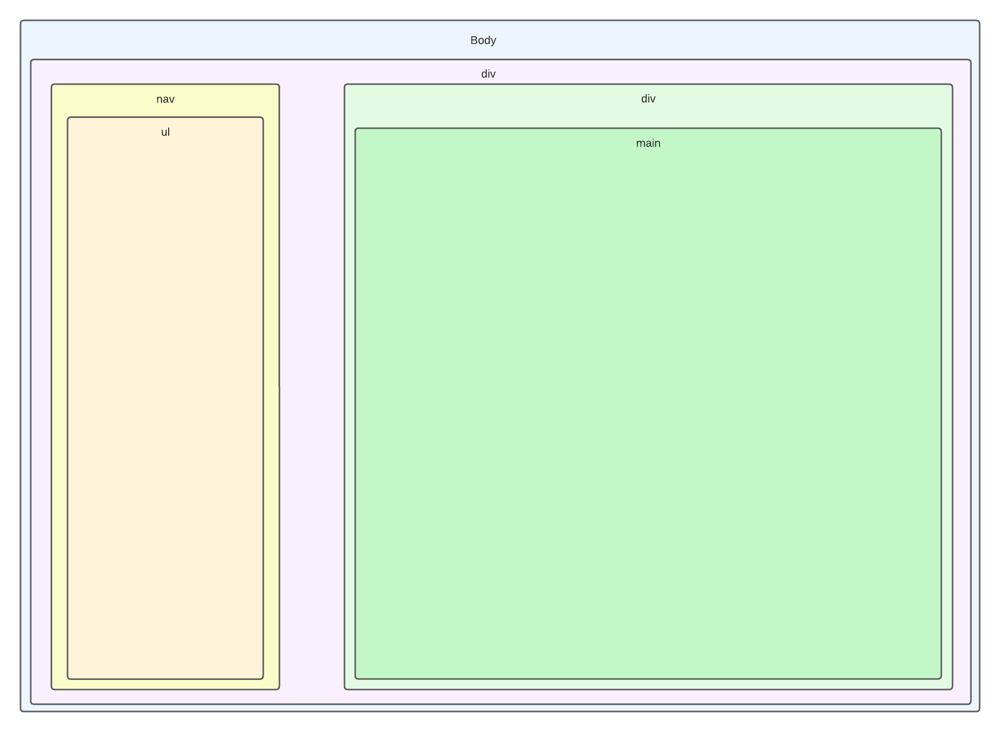

# 
<u>Dossier de test du site web</u>

  

  <blockquote style="text-align: right;">
    Prénoms & Noms des étudiants : 
    Rayan BEN TANFOUS 
    Armand CLOUZEAU 
    Sarah BADER 
    Ismail AKBOULATOV 
    Aymeric PESENTI
  </blockquote>

# 
<u>Table des Matières</u>

## [<u>I. Test de la page d'accueil selon la maquette</u>](#chap1)
## [<u>II. Test de la page Connexion & Inscription</u>](#chap2)
## [<u>III. Test de la page de création de ticket</u>](#chap3)
## [<u>IV. Test de la page utilisateur selon la maquette</u>](#chap4)
## [<u>V. Test de la page admin système selon la maquette utilisateur</u>](#chap5)
## [<u>VI. Test de la page technicien selon la maquette utilisateur</u>](#chap6)
## [<u>VII. Test de la page admin web selon la maquette utilisateur</u>](#chap7)
***

## I. Test de la page d'accueil selon la maquette : 
### - Maquette de la page d'accueil

### - Page statique du site 

On peut voir que le site correspond bien à la maquette qui a servi de plan
pour sa création en quelques observations :
- La barre de navigation (`nav`) qui se trouve sur le côté est bien placée.
- Le `main` occupe bien l'espace qui lui est dédié, de même pour le `footer`.

### Le test de la page d'accueil est réussi, le site concorde bien avec la maquette.

 

---

  

## II. Test de la page Connexion & Inscription : 
### - Maquette de la page Connexion & Inscription

### - Résultat de la page Connexion & Inscription

On constate que la réalisation de la page *Connexion & Inscription* concorde parfaitement avec la maquette qui a été 
élaborée comme plan directeur. Cette harmonie entre la conception préliminaire et le produit final se manifeste à 
travers plusieurs points d'observation :

- L'utilisation judicieuse des balises `<form>`, `<label>`, `<input>`, `<button>`, et `<h1>` confirme une mise en page 
soigneusement planifiée, respectant ainsi fidèlement la maquette initiale.
- La création de différentes `divs` a permis l'implémentation d'un script JavaScript astucieux. Grâce à un simple bouton,
la permutation entre les deux états de la page (inscription et connexion) est réalisée avec succès, offrant ainsi une 
expérience utilisateur fluide.

En examinant de près la structure de la page, on peut noter que les balises HTML susmentionnées sont positionnées de manière cohérente, témoignant d'une exécution précise du plan de conception.

### Le test de la page Connexion & Inscription est réussi, le site concorde bien avec la maquette.

 

---

  

## III. Test de la page de création de ticket : 
### - Maquette de la page de création de ticket

### - Résultat de la page de création de ticket

On observe que la réalisation de la page *Création de Ticket* est en parfait accord avec la maquette initiale qui 
présentait une structure comprenant :

- Un élément `<main>` englobant l'ensemble du contenu de la page.
    - Une `div` interne contenant un `<h1>` pour le titre et un formulaire `<form>` pour la création de ticket.

À l'intérieur du formulaire, chaque balise est positionnée conformément à la maquette :

- Les balises `<label>` sont utilisées pour les éléments descriptifs associés aux champs de saisie.
- Les balises `<input>` sont présentes pour les champs de saisie classiques.
- La balise `<textarea>` est utilisée pour la zone de texte permettant une saisie plus étendue.
- La balise `<select>` est présente pour les menus déroulants, offrant des options prédéfinies.

Cette disposition met en lumière une cohérence entre la conception anticipée et la réalisation effective de la page, où 
chaque balise est soigneusement intégrée, conforme à la vision initiale de la maquette.

### Le test de la page de création de ticket est réussi, le site concorde bien avec la maquette.

 

---

  

## IV. Test de la page utilisateur selon la maquette : 
### - Maquette de la page utilisateur

### - Page du site

On peut voir que le site correspond bien à la maquette qui a servi de plan
pour sa création en quelques observations :
- Le `<nav>` est bien sur le côté.
- Le `<main>` occupe bien l'espace qui lui a été attribué

Il est important de noter que la structure de la page utilisateur a été reprise pour les autres pages des différents users du site, c'est-à-dire les techniciens, l'admin système, l'admin web, etc.

### Le test de la page utilisateur est réussi, le site concorde bien avec la maquette.
 

---

 

## V. Test de la page admin système selon la maquette utilisateur : 
### - Maquette de la page utilisateur

### - Page statique du site

On peut voir que le site correspond bien à la maquette utilisateur généralisé qui a servi de plan.

### Le test de la page admin système est réussi, le site concorde bien avec la maquette.

---

## VI. Test de la page technicien selon la maquette utilisateur : 
### - Maquette de la page utilisateur

### - Page du site

On peut voir que le site correspond bien à la maquette utilisateur généralisé qui a servi de plan.

### Le test de la page technicien est réussi, le site concorde bien avec la maquette.

 

---

## VII. Test de la page admin web selon la maquette utilisateur : 
### - Maquette de la page utilisateur

### - Page du site

On peut voir que le site correspond bien à la maquette utilisateur généralisé qui a servi de plan.

### Le test de la page admin web est réussi, le site concorde bien avec la maquette.

