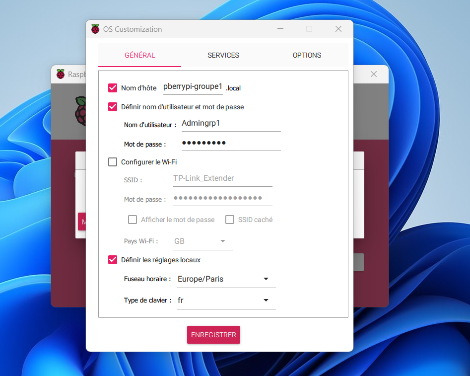
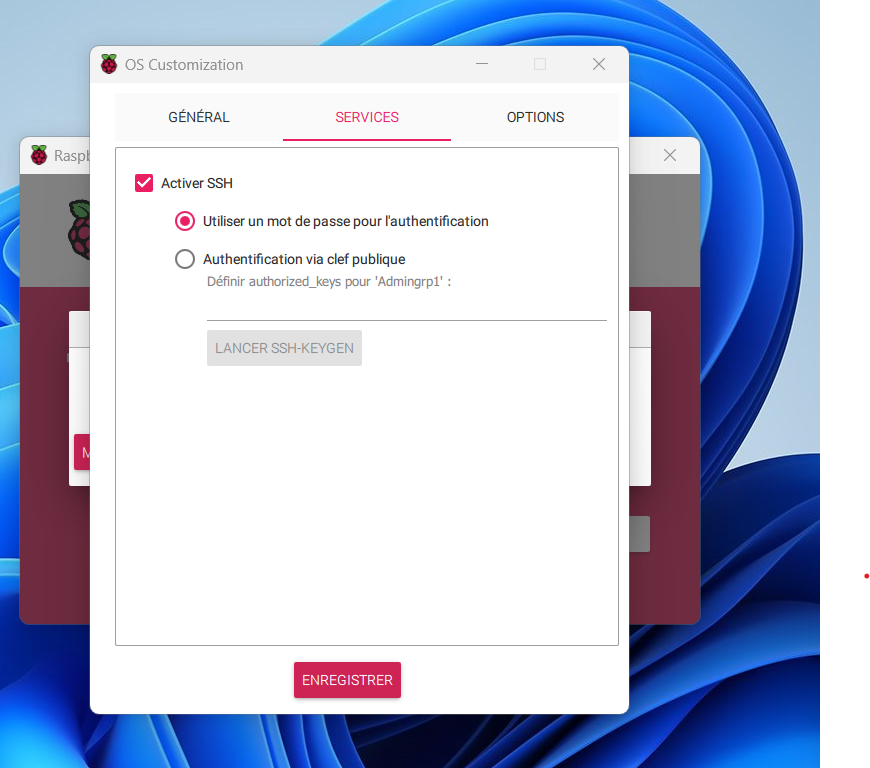
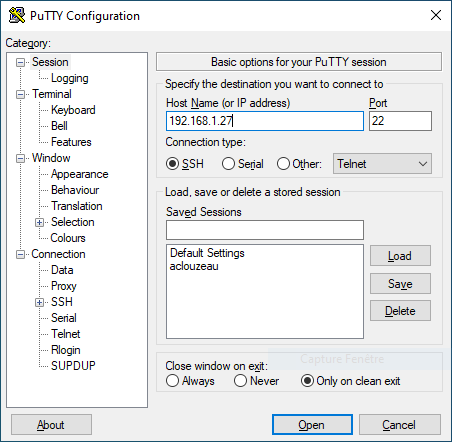
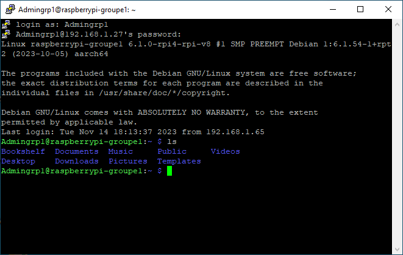
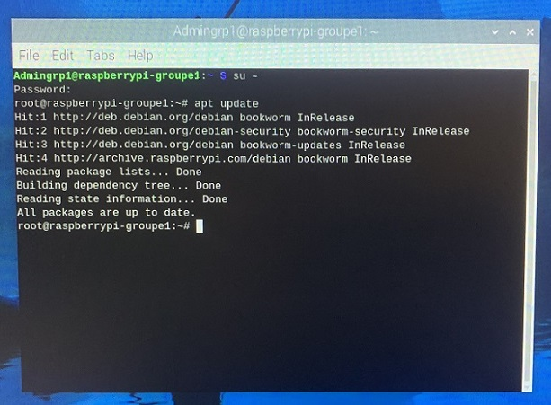
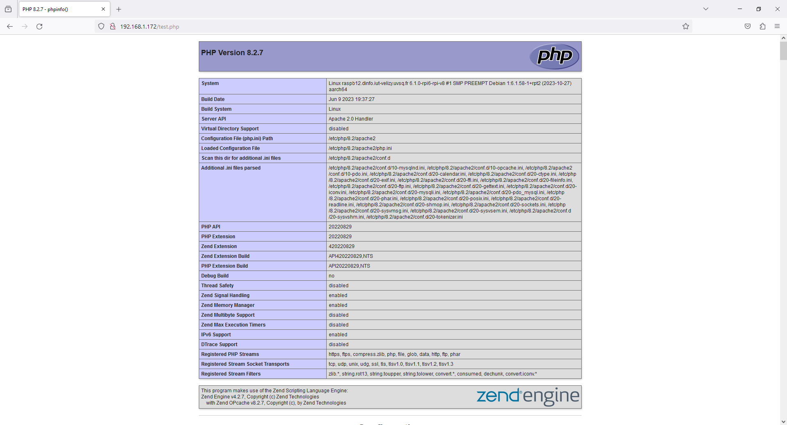

# 
<u> Rapport sur la Configuration du Raspberry Pi 4 pour la Plateforme de Ticketing</u>

  

  <blockquote style="text-align: right;">
    Noms des étudiants :
      BEN TANFOUS - CLOUZEAU - BADER - AKBOULATOV - PESENTI
  </blockquote>

# Sommaire

- [I. Introduction](#introduction)
- [II. Flashage de la Carte SD](#flashage-de-la-carte-sd)
    - [1. Personnalisation de la configuration](#personnalisation-de-la-configuration)
    - [2. Activation du SSH](#activation-du-ssh)
- [III. Première Utilisation du Raspberry Pi](#premiere-utilisation-du-raspberry-pi)
    - [1. Configuration Initiale et Démarrage](#configuration-initiale-et-demarrage)
    - [2. Accès et Vérifications](#acces-et-verifications)
    - [3. Accès à Distance via SSH](#acces-a-distance-via-ssh)
    - [4. Mises à Jour Initiales](#mises-a-jour-initiales)
    - [5. Analyse des Résultats](#analyse-des-résultats)
    - [6.Ajouts suite aux demandes du client](#ajouts-suite-demandes-client)
- [IV. Conclusion](#conclusion)

## <a id="introduction">I. Introduction</a>

Dans le cadre de notre projet visant à développer une plateforme de ticketing hébergée sur un Raspberry Pi 4, nous avons entrepris la configuration complète du matériel fourni par le client. Voici un résumé des étapes que nous avons suivies pour configurer le Raspberry Pi 4 à partir de la carte SD vierge.

## <a id="flashage-de-la-carte-sd">II. Flashage de la Carte SD</a>

### <a id="personnalisation-de-la-configuration">Personnalisation de la configuration :</a>

Utilisation de l'outil 'Raspberry Pi Imager', téléchargé depuis le site officiel de Raspberry Pi, pour flasher la carte SD avec le système d'exploitation requis pour notre projet. Nous avons choisi la version du système d'exploitation (Raspbian) qui nous a été recommandée par l'outil de configuration 'Raspberry Pi Imager'. Cette étape nous a également permis de personnaliser la configuration de la machine en spécifiant les détails suivants :
- Nom d'hôte : `pberrypi-group1.local`
- Nom d'utilisateur : `Admingrp1`
- Mot de passe : `********`
- Fuseau horaire et autres configurations mineures.

    

### <a id="activation-du-ssh">Activation du SSH :</a>

Lors de la configuration de la carte SD à l'aide de Raspberry Pi Imager, le protocole SSH a été activé sur le port 22. Le SSH permet un accès sécurisé et distant au Raspberry Pi pour sa gestion et sa configuration.

    

## <a id="premiere-utilisation-du-raspberry-pi">III. Première Utilisation du Raspberry Pi</a>

### <a id="configuration-initiale-et-demarrage">Configuration Initiale et Démarrage</a>

Une fois alimenté, le Raspberry Pi a démarré et amorcé le processus d'initialisation. Nous avons observé attentivement le démarrage
pour détecter d'éventuels problèmes matériels, mais l'appareil a démarré correctement, affichant les informations de démarrage sur l'écran.

### <a id="acces-et-verifications">Accès et Vérifications</a>

Nous avons utilisé un écran, un clavier et une souris ainsi qu'un câble RJ45 branchés directement au Raspberry Pi pour effectuer les premières vérifications :
- Vérification de la séquence de démarrage via l'écran connecté.
- Test des fonctionnalités de base, telles que la navigation dans l'interface graphique ainsi que dans le terminal de commande, pour s'assurer du bon fonctionnement initial.
- Ajout d'un mot de passe au super utilisateur.
- Vérification de la connectivité réseau en accédant à des sites Web externes afin de confirmer la connexion Internet.

### <a id="acces-a-distance-via-ssh">Accès à Distance via SSH</a>

En parallèle, nous avons également effectué une connexion SSH depuis un ordinateur distant pour vérifier la possibilité d'accéder au Raspberry Pi à distance. Cette étape nous a permis de confirmer la disponibilité du Raspberry Pi sur le réseau et de garantir le bon fonctionnement du protocole SSH.

Pour valider cette connexion, nous avons identifié l'adresse IP du Raspberry Pi, puis utilisé le logiciel PuTTY sur un deuxième ordinateur pour établir une connexion SSH réussie.

    
    

### <a id="mises-a-jour-initiales">Mises à Jour Initiales</a>

Une fois la fonctionnalité de connexion SSH confirmée et opérationnelle, nous avons finalisé la configuration du Raspberry Pi 4 en mettant à jour les differents packets se trouvant sur notre systeme. Cette démarche visait à assurer la stabilité et la sécurité du système.
- Exécution de la commande "apt update" pour mettre à jour la liste des paquets disponibles.
- Utilisation des outils intégrés par Raspberry Pi pour assurer la mise à jour des applications installées.

    

### <a id="ajouts-suite-demandes-client">Ajouts suite aux demandes du client</a>

Suite aux retours du client concernant la configuration du Raspberry Pi 4, plusieurs ajustements ont été effectués pour répondre à ses besoins spécifiques.

#### Installation des Services Additionnels

Nous avons pris en compte les demandes du client concernant l'installation de plusieurs services clés pour le bon fonctionnement de la plateforme de ticketing.

1. **Apache2 :**
- Commande d'installation : `sudo apt install apache2`
- Confirmation du statut : `sudo systemctl status apache2`
- Validation de l'installation : Accès à l'adresse IP dans un navigateur, confirmant le bon fonctionnement via la page par défaut d'Apache.

2. **PHP :**
- Commande d'installation : `sudo apt install php libapache2-mod-php`
- Vérification de l'installation : Création d'un script PHP affichant la fonction `phpinfo` dans le répertoire /var/www/html et confirmation via le navigateur.

    

3. **Installation de MariaDB :**
- Commande d'installation : `sudo apt install mariadb-server php-mysql`
- Création d'un nouvel utilisateur root avec permissions : Séquence de commandes SQL pour la création d'un nouvel utilisateur avec les permissions adéquates.

4. **Installation de PHPMyAdmin :**
- Commande d'installation : `sudo apt install phpmyadmin`
- Validation du fonctionnement : Accès via le navigateur en utilisant l'adresse IP du Raspberry Pi 4 suivie de "/phpmyadmin" (par exemple : "192.168.1.172/phpmyadmin").

5. **Installation de Fail2ban :**
- Commande d'installation : `sudo apt install fail2ban`
- Création et configuration d'une prison qui contiendra les adresses IP des utilisateurs bannis.
- Validation du fonctionnement : test d'intrusion et vérification du bon fonctionnement de la prison avec la commande `sudo fail2ban-client status`.

#### Remarque sur R Studio

Nous avions initialement l'intention d'installer notre application R Shiny sur notre Raspberry Pi 4 afin de l'intégrer dans notre plateforme de ticketing. Cependant, nous avons rencontré un problème majeur lors de l'installation de R Studio sur la Raspberry Pi.

En raison du fait que nous n'avons pas accès à l'interface graphique de la Raspberry Pi, l'utilisation de R Studio devient impossible. Cette limitation nous empêche d'intégrer notre application, développée en R Shiny pour des analyses statistiques, dans notre site web.

Face à cette difficulté, nous avons envisagé l'utilisation d'un conteneur Docker comme solution alternative pour contourner ce problème. Cependant, en raison d'un manque de connaissances et de temps, nous n'avons pas pu mettre en œuvre cette approche.

La difficulté d'installer R Studio sur une Raspberry Pi, en particulier sans interface graphique, constitue un obstacle significatif pour la réalisation de notre projet, et nous devons continuer à explorer des solutions afin d'intégrer efficacement nos analyses statistiques dans notre plateforme de ticketing.

### <a id="conclusion">Conclusion</a>

La configuration du Raspberry Pi 4 pour le déploiement de la plateforme de ticketing a été menée à bien, en accord avec les directives discutées avec le client.
Chaque étape, de la configuration initiale à la vérification de la connexion SSH et aux mises à jour, a été menée avec succès. Ainsi, l'appareil est prêt à être utilisé dans le cadre de notre projet.

